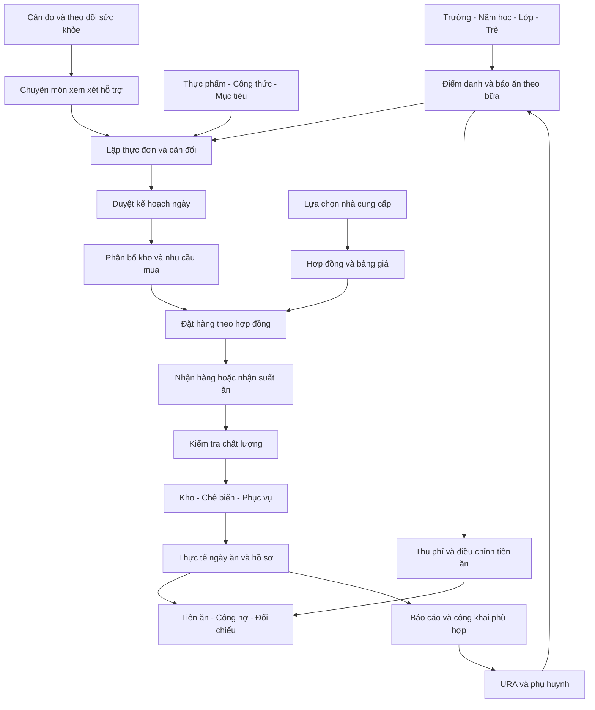
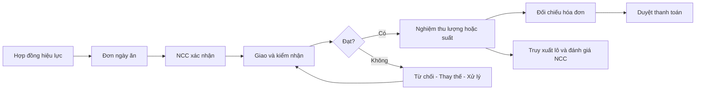

# BLUEPRINT HỆ THỐNG QUẢN LÝ MẦM NON

## Dinh dưỡng, cân đối lượng–chất, vận hành và lựa chọn nhà cung cấp thực phẩm/suất ăn

**Phiên bản:** 1.0 — **Ngày khảo sát:** 10/09/2026 — **Mục đích:** xây dựng phần mềm tương tự hệ thống QLMN/PMS, đồng thời có tài liệu hướng dẫn người dùng cơ bản.

## 1. Phạm vi và cách đọc

Tài liệu có ba lớp: ghi nhận sản phẩm tham chiếu, hướng dẫn nghiệp vụ, và thiết kế phần mềm đề xuất. Không coi giao diện đã xem là bằng chứng về thuật toán hoặc hành vi sau khi lưu.

| Ký hiệu | Ý nghĩa |
|---|---|
| QS | Đã quan sát màn hình, trường dữ liệu hoặc nút chức năng trong phiên khảo sát; chưa mặc nhiên kiểm thử việc ghi dữ liệu |
| GT | Được trang chủ giới thiệu; chưa kiểm chứng quy trình bên trong bằng tài khoản hiện có |
| DX | Đề xuất cho sản phẩm mới; không khẳng định QLMN đã có |
| CX | Cần xác minh trước khi chốt thiết kế hoặc triển khai thực tế |

“Toàn bộ hệ thống” trong blueprint là bản đồ bao phủ các phân hệ công khai được giới thiệu và các chức năng truy cập được. Chưa thể chứng nhận đã kiểm kê hết chức năng ẩn theo quyền, cấu hình riêng của từng trường hoặc gói dịch vụ. Các phân hệ Thu chi, Cân đo, Chuyên môn, Quản trị và URA cần một vòng khảo sát bổ sung có quyền phù hợp.

Đã khảo sát trực tiếp phần Dinh dưỡng: cơ cấu, nhà cung cấp, thực phẩm, món ăn, thực đơn mẫu, nhập kho, tồn kho, lịch sử, sổ kho, cân đối ngày và biểu mẫu. Không lưu, xóa, duyệt, ghi sổ hoặc gửi hồ sơ đấu thầu. Không đưa danh tính trẻ, thông tin liên hệ hay giấy tờ cá nhân của nhà cung cấp vào tài liệu.

Phần thiết kế sau đây là yêu cầu cho sản phẩm mới. Tài liệu phát triển ban đầu có tại [Kế hoạch phần mềm dinh dưỡng](PLAN_PHAN_MEM_DINH_DUONG.md); blueprint này mở rộng phạm vi, không coi ước lượng của MVP dinh dưỡng là ước lượng cho toàn bộ hệ thống.

## 2. Kết luận nghiệp vụ quan trọng

Một ngày ăn phải trả lời được năm câu hỏi độc lập:

1. **Đủ lượng theo mục tiêu dinh dưỡng chưa?** Năng lượng một trẻ nhận tại trường có phù hợp nhóm tuổi, thời gian ở trường và các bữa đã đăng ký không?
2. **Cân đối chất chưa?** Năng lượng đến từ đạm, béo, bột đường có cơ cấu phù hợp không? Các yêu cầu về nguồn thực phẩm, vi chất và sự đa dạng đã được xét chưa?
3. **Có chế biến và chia được không?** Khối lượng phần ăn, độ thô/mềm, điều kiện bếp, thời gian và số suất có khả thi không?
4. **Có nằm trong ngân sách không?** Phần chi thực phẩm, tồn kho sử dụng, dịch vụ và chênh lệch được phân biệt rõ không?
5. **Có bảo đảm an toàn và truy xuất không?** Thực phẩm/suất ăn có nguồn gốc, kiểm nhận, xử lý bất thường và hồ sơ phù hợp không?

Nhãn “đạt” ở một chỉ tiêu không thay thế bốn câu hỏi còn lại. Thực đơn đủ tiền vẫn có thể thiếu năng lượng. Thực đơn đủ calo vẫn có thể quá nhiều chất béo. Một thực đơn cân đối trên máy vẫn có thể không phù hợp dị ứng hoặc không được trẻ ăn hết.

## 3. Từ điển cho người dùng mới

| Thuật ngữ | Hiểu đơn giản | Không nhầm với |
|---|---|---|
| Lượng ăn một trẻ | Khối lượng phần nguyên liệu ăn được dùng tính khẩu phần của một trẻ | Khối lượng mua có vỏ, xương, phần bỏ |
| Lượng mua | Khối lượng/đơn vị cần nhận từ nhà cung cấp sau khi xét phần loại bỏ | Lượng thức ăn đã nấu |
| Năng lượng, kcal | Năng lượng khẩu phần cung cấp theo dữ liệu thực phẩm | Gam thực phẩm hoặc số tiền |
| P | Protein, chất đạm | Chỉ thịt; đạm có trong nhiều thực phẩm |
| L | Lipid, chất béo | Chỉ dầu; nguyên liệu khác cũng chứa béo |
| G | Glucid, chất bột đường | Chỉ đường ăn; nhãn “Đường” trên hệ thống cần xác minh phạm vi dữ liệu |
| Tỷ lệ P:L:G | Phần trăm năng lượng do từng chất tạo ra | Tỷ lệ gam P, L, G |
| Tỷ lệ đạt năng lượng | Năng lượng tính được chia mục tiêu cùng phạm vi | Tỷ lệ các chất trong tổng năng lượng |
| Hệ số thải bỏ | Phần không ăn được khi sơ chế nguyên liệu mua | Hao hụt kho hoặc tỷ lệ trẻ bỏ thừa |
| Quy đổi | Một đơn vị mua tương ứng bao nhiêu gam/ml theo cơ sở dữ liệu | Mọi hộp/quả đều có cùng khối lượng |
| Định mức | Mục tiêu hoặc khoảng được phê duyệt cho nhóm tuổi và chế độ ăn | Một số cố định dùng cho mọi trẻ |
| Kế hoạch | Dự tính trước ngày ăn | Thực nhận, thực xuất hoặc trẻ thực ăn |
| Suất ăn | Đơn vị dịch vụ theo hợp đồng và nhóm tuổi/bữa | Một trẻ có mặt cả ngày bất kể số bữa |

### 3.1. Cách hiểu nhãn “lượng” và “chất” trên QLMN

QS: thực đơn có hai đánh giá riêng về lượng và chất; phần chi tiết có tổng calo, định mức, tỷ lệ đạt và cơ cấu P:L:G. Có thể quan sát thực đơn có chênh lệch tiền thấp nhưng lượng hoặc chất chưa đạt.

**Suy luận nghiệp vụ:** lượng liên quan mức đáp ứng khẩu phần/năng lượng; chất liên quan cơ cấu dinh dưỡng. **CX:** chưa có bằng chứng xác nhận toàn bộ điều kiện và ngưỡng mà QLMN dùng để sinh hai nhãn. Không sao chép nhãn thành thuật toán chỉ từ một vài dòng dữ liệu.

DX: sản phẩm mới phải hiển thị cả số đo, mục tiêu, sai lệch và lý do; ví dụ “Năng lượng 585/650 kcal, đạt 90%”, thay vì chỉ hiển thị “Chưa đạt”.

### 3.2. Căn cứ chuyên môn và phạm vi áp dụng

Tài liệu Chuyên đề 5 năm 2026 mang tên Bộ GDĐT có nội dung phục vụ chương trình mầm non thí điểm. Tài liệu trình bày tỷ lệ năng lượng P:L:G: nhà trẻ 13–20% : 30–40% : 40–50%; mẫu giáo 13–20% : 25–35% : 45–65%, cùng hệ số tính minh họa 4 kcal/g đạm, 9 kcal/g béo, 4 kcal/g bột đường. Đây là tài liệu tham khảo có phạm vi, không tự động là cấu hình bắt buộc cho mọi trường. [Tài liệu chuyên đề, trang 6–7](https://mnmyha.ninhbinh.edu.vn/wp-content/uploads/2026/05/CV-1700-C%C4%905-T%E1%BB%95-ch%E1%BB%A9c-ho%E1%BA%A1t-%C4%91%E1%BB%99ng-NDCS-b%E1%BA%A3o-%C4%91%E1%BA%A3m-an-to%C3%A0n-cho-tr%E1%BA%BB-em-trong-c%C6%A1-s%E1%BB%9F-GDMN.pdf).

Hướng dẫn tại Quyết định 3958/QĐ-BYT về bữa ăn học đường nêu phạm vi giáo dục phổ thông; đối với mầm non, dẫn về chương trình mầm non hiện hành của Bộ GDĐT. Không lấy bảng tuổi của phổ thông để áp cho trẻ mầm non. [Bản hướng dẫn trên Viện Dinh dưỡng](https://viendinhduong.vn/storage/app/uploads/public/2026/05/26/q_3958qbyt_huong_dan_dinh_duong_bua_an_hoc_uong.pdf).

Trước vận hành, người phụ trách chuyên môn phải duyệt nguồn tiêu chuẩn, nhóm tuổi, phạm vi bữa, ngày hiệu lực và khoảng chấp nhận. Đặc biệt không lấy nhu cầu cả ngày làm nhu cầu tại trường nếu trẻ chỉ ăn một phần số bữa. Những số đang có trong bảng Cơ cấu QLMN chỉ là dữ liệu cấu hình đã quan sát, chưa được xác nhận là tiêu chuẩn hiện hành.

## 4. Công thức và mô hình cân đối đề xuất

### 4.1. Dữ liệu bắt buộc trước khi tính

| Nhóm | Đầu vào | Kiểm tra |
|---|---|---|
| Trẻ và suất | Ngày, điểm trường, nhóm tuổi, số trẻ theo từng bữa, suất đặc biệt | Không dùng tổng sĩ số thay số đăng ký ăn; không gộp các nhóm tuổi thành một khẩu phần |
| Mục tiêu | Năng lượng tại trường, cơ cấu, phân bổ bữa, điều kiện bổ sung | Cùng nhóm tuổi và phạm vi bữa; còn hiệu lực |
| Công thức món | Thực phẩm, lượng ăn được một trẻ, trạng thái sống/chín, cách chế biến | Không tính trùng thành phần của món tổng hợp |
| Dữ liệu thực phẩm | Dinh dưỡng theo 100 g hoặc 100 ml, đơn vị, quy đổi, thải bỏ | Có nguồn và phiên bản; không biến thiếu dữ liệu thành số 0 |
| Giá và ngân sách | Giá theo ngày/hợp đồng, thuế và phí theo quy ước, tiền thực phẩm được phép dùng | Đơn vị giá khớp đơn vị mua; tách dịch vụ |
| Kho | Lô, lượng khả dụng, hạn sử dụng, phần đã giữ cho kế hoạch khác | Không dùng toàn bộ tồn sổ làm tồn có thể cấp |

### 4.2. Tính chất dinh dưỡng và năng lượng

Với nguyên liệu i có lượng ăn được xᵢ gam/trẻ và dữ liệu Pᵢ, Lᵢ, Gᵢ gam trên 100 gam cùng trạng thái:

```text
P_tổng = Σ(xᵢ × Pᵢ / 100)
L_tổng = Σ(xᵢ × Lᵢ / 100)
G_tổng = Σ(xᵢ × Gᵢ / 100)
E_tính = 4 × P_tổng + 9 × L_tổng + 4 × G_tổng
P_% = 100 × 4 × P_tổng / E_tính
L_% = 100 × 9 × L_tổng / E_tính
G_% = 100 × 4 × G_tổng / E_tính
Đáp_ứng_năng_lượng_% = 100 × E_tính / E_mục_tiêu
```

Đây là thuật toán đề xuất cho ví dụ, không xác nhận là thuật toán PMS. Nếu bộ dữ liệu có năng lượng công bố riêng hoặc dùng hệ số khác, phải lựa chọn quy tắc nhất quán, ghi nguồn và giải thích chênh lệch. Không âm thầm trộn năng lượng công bố với mẫu số tính theo hệ số khác rồi yêu cầu ba tỷ lệ cộng đúng 100%.

Phải xử lý E = 0 là “chưa đủ dữ liệu”, không chia cho 0. Với dữ liệu theo 100 ml, tính theo thể tích; chỉ chuyển ml sang gam khi có căn cứ khối lượng riêng hoặc quy đổi của sản phẩm. Nếu dùng bảng thành phần nguyên liệu sống, không thay trực tiếp bằng cân nặng món đã nấu. Hệ số thu hồi sau nấu và hệ số giữ lại dưỡng chất, nếu triển khai, là hai thông số riêng có nguồn.

Đạm động vật % = đạm động vật / tổng đạm × 100; không chia cho tổng khối lượng món ăn. Chất béo động vật/thực vật cần dữ liệu phân loại phù hợp, nhất là sản phẩm pha trộn. Cơ cấu P:L:G không chứng minh đủ sắt, canxi, chất xơ hoặc mọi vi chất: chỉ đánh giá chỉ tiêu nào có dữ liệu và mục tiêu được duyệt.

### 4.3. Từ lượng ăn sang lượng mua

```text
Ăn_được_nhóm_kg = gam_ăn_được_một_trẻ × số_suất / 1000
Mua_thô_kg = Ăn_được_nhóm_kg / (1 − tỷ_lệ_thải_bỏ)
Số_đơn_vị_mua = Mua_thô_kg × 1000 / gam_mỗi_đơn_vị
Nhu_cầu_đặt_mới = max(0, nhu_cầu_cùng_cơ_sở_đơn_vị − kho_khả_dụng_được_phân_bổ)
Tiền_mua = Số_đơn_vị_mua_đã_làm_tròn × giá_mỗi_đơn_vị
```

Các bữa có số suất khác nhau phải tính riêng rồi cộng. Chỉ trừ tồn khi cùng mã/quy cách/cơ sở trọng lượng và đạt điều kiện sử dụng. Quy tắc làm tròn kg, quả, hộp phải theo quy cách mua; phần dư do làm tròn trở thành tồn hoặc lượng sử dụng được ghi nhận, không biến mất.

**Ví dụ giả lập:** 100 suất, mỗi suất cần 40 g ăn được, thải bỏ 20%: cần 4 kg ăn được và 5 kg nguyên liệu thô. Không dùng 4 × 1,2 = 4,8 kg. Nếu có 1,5 kg nguyên liệu thô khả dụng thì đặt 3,5 kg. Giá giả định 80.000 đồng/kg: đơn mua 280.000 đồng. Nếu 1,5 kg xuất kho có giá trị 114.000 đồng, tổng giá trị thực phẩm sử dụng là 394.000 đồng theo giả định giá nêu trên, khác số tiền mua thêm hôm nay.

### 4.4. Tiền ăn: phải tách ba phép đối chiếu

1. **Thu/được phân bổ:** số suất tính tiền × mức được phép dùng cho thực phẩm, cộng/trừ khoản điều chỉnh có căn cứ.
2. **Chi mua:** hàng mua trong kỳ và các khoản liên quan theo chính sách kế toán.
3. **Tiêu dùng:** giá trị thực phẩm thực xuất và mua dùng trực tiếp, không tính trùng hàng đã nhập rồi xuất.

Chênh lệch ngân sách thực phẩm = ngân sách được phân bổ − giá trị thực phẩm sử dụng, nếu đó là quy ước được trường phê duyệt. Thu tiền, công nợ và thanh toán có ngày khác ngày ăn; không gộp chúng vào một số “chi phí”. Công thức tiền dịch vụ, bổ trợ, chênh lệch chuyển ngày trên PMS chưa được kiểm chứng; phải chốt qua mẫu đối chiếu với kế toán.

## 5. Ví dụ cân đối lượng–chất từ đầu đến cuối

Tất cả số sau chỉ để học cách đọc kết quả, không phải thực đơn hay khuyến nghị cho một trẻ cụ thể. Giả định hồ sơ mục tiêu của nhóm đã được chuyên môn duyệt: **650 kcal tại trường**, cơ cấu đích **16% : 28% : 56%**. Khoảng chấp nhận do hồ sơ cấu hình, không suy ra từ ví dụ.

| Trường hợp | Năng lượng | P:L:G theo năng lượng | Nhận xét |
|---|---:|---|---|
| A | 650 kcal | 10:40:50 | Đúng mức năng lượng mục tiêu, cơ cấu khác đích |
| B | 585 kcal | 10:40:50 | Giảm đều 10% mọi nguyên liệu: năng lượng giảm, cơ cấu không đổi |
| C | 650 kcal | 16:28:56 | Đạt đúng đích số học của ví dụ; còn phải kiểm tra món, vi chất, an toàn và tiền |

Ở A: P = 16,25 g; L ≈ 28,89 g; G = 81,25 g. Ở C: P = 26 g; L ≈ 20,22 g; G = 91 g. Để đi từ A đến C, tổng dinh dưỡng cần thay đổi khoảng +9,75 g đạm, −8,67 g béo, +9,75 g bột đường. Đây là **chênh lệch chất dinh dưỡng**, không phải số gam thịt/dầu/gạo cần nhập trực tiếp.

Người dùng thực hiện:

1. Mở chi tiết thực đơn A; ghi lại năng lượng, ba tỷ lệ và tiền một trẻ.
2. Kiểm tra đơn vị và nguyên liệu đóng góp nhiều năng lượng/béo. Nếu sai quy đổi, sửa dữ liệu nguồn có kiểm chứng trước khi sửa món.
3. Chọn một thay đổi nhỏ có ý nghĩa: điều chỉnh nguyên liệu giàu béo hoặc chọn công thức thay thế đã duyệt; không giảm đồng loạt mọi món.
4. Tính lại toàn bộ vì mỗi nguyên liệu có thể chứa nhiều chất. Xem cả năng lượng và tỷ lệ mới.
5. Điều chỉnh phần cung cấp đạm và bột đường theo công thức món khả thi. Không coi một thực phẩm là “đạm thuần” hay “bột đường thuần”.
6. Kiểm tra khối lượng một suất, độ phù hợp nhóm tuổi, bữa phụ, nguyên liệu dị ứng và khả năng bếp.
7. Tính lại giá, tồn kho và lượng đặt. Nếu vượt ngân sách, so sánh phương án nguyên liệu/công thức tương đương đã được chuyên môn chấp thuận.
8. Lưu phương án nháp cùng kết quả trước/sau; người phụ trách duyệt. Không tự đổi mục tiêu để nhãn chuyển xanh.

**Câu hỏi quyết định:** Nếu chỉ thiếu năng lượng mà cơ cấu đã phù hợp, tăng cùng tỷ lệ các phần có thể là một phương án sơ bộ; vẫn kiểm tra khối lượng thực ăn và giá. Nếu cơ cấu sai, tăng/giảm đều không sửa được cơ cấu. Nếu không có phương án thỏa đồng thời ngân sách và yêu cầu, báo “chưa tìm được phương án khả thi” để điều chỉnh có thẩm quyền.

### 5.1. Ma trận xử lý nhanh

| Lượng | Chất | Tiền | Làm gì trước |
|---|---|---|---|
| Thiếu | Phù hợp | Còn ngân sách | Kiểm tra phạm vi bữa và số liệu; tăng khẩu phần phù hợp rồi tính lại |
| Thừa | Phù hợp | Bất kỳ | Kiểm tra quy đổi; điều chỉnh phần ăn có kiểm soát |
| Đủ | Lệch | Đủ | Thay cơ cấu nguyên liệu, giữ theo dõi tổng năng lượng |
| Thiếu | Lệch | Đủ | Sửa thành phần thiếu tương đối; tránh thêm chỉ dầu/đường để tăng calo |
| Đủ | Phù hợp | Vượt | So sánh món/nguồn hàng đủ chất lượng; không hạ chuẩn dữ liệu hoặc an toàn |
| Bất kỳ | Không rõ | Không rõ | Hoàn thiện dữ liệu thiếu trước khi kết luận |
| Đủ | Phù hợp | Đủ | Kiểm tra an toàn, dị ứng, bữa, khả năng chế biến rồi trình duyệt |

## 6. Hướng dẫn thao tác cho người dùng cơ bản

Các tên màn hình/nút ghi QS là đã thấy trên QLMN. Các bước phê duyệt, khóa ngày, cảnh báo giải thích là DX cho phần mềm mới. Hướng dẫn dưới đây không khẳng định đã kiểm thử thao tác lưu trên hệ thống tham chiếu.

### 6.1. Chuẩn bị lần đầu

| Bước | Thao tác | Kết quả cần có | Dừng xử lý khi |
|---|---|---|---|
| 1 | Kiểm tra trường, điểm trường, năm học và quyền tài khoản | Đúng phạm vi làm việc | Không thấy điểm trường cần dùng |
| 2 | Mở Cơ cấu dinh dưỡng; đối chiếu nhóm tuổi và phạm vi calo với hồ sơ chuyên môn | Bộ mục tiêu được người có trách nhiệm xác nhận | Không biết calo là cả ngày hay tại trường |
| 3 | Mở Nhà cung cấp; rà soát mã và đầu mối | Danh mục không trùng | Cùng một đơn vị có nhiều mã không rõ nguyên nhân |
| 4 | Mở Thực phẩm trường; kiểm tra nguồn dinh dưỡng, ĐVT, quy đổi, thải bỏ và giá | Bộ nguyên liệu dùng được | Giá bằng 0, thiếu quy đổi hoặc sai trạng thái sống/chín |
| 5 | Mở Món ăn; chọn công thức đúng nhóm tuổi | Thư viện món đã rà soát | Món chưa rõ lượng một trẻ hoặc quy mô công thức |
| 6 | Mở Thực đơn mẫu; chọn hoặc xây mẫu theo bữa | Mẫu có kết quả lượng, chất, tiền | Sao chép mẫu nơi khác nhưng chưa cập nhật giá/tuổi |
| 7 | Đối chiếu tồn kho đầu kỳ với thực tế | Tồn có căn cứ theo kho/lô | Chênh lệch chưa giải thích |

Người mới chỉ cần bắt đầu bằng một nhóm tuổi, một điểm trường, một ngày ăn. Không nhập hàng loạt trước khi đối chiếu đúng một ví dụ nhỏ.

### 6.2. Trước ngày ăn: lập và cân đối

1. Vào **Cân đối khẩu phần**, chọn đúng tháng. Chọn **Cân đối thực đơn ngày** để lập mới; với ngày đã có dùng thao tác sửa tương ứng. Không tạo thêm ngày trùng chỉ vì chưa nhìn thấy dữ liệu sau khi lọc.
2. Kiểm tra ngày, nhóm Nhà trẻ/Mẫu giáo và các bữa. Nhóm “Ăn sáng” hiển thị trên hệ thống cần được phân biệt với nhóm tuổi trong mô hình mới.
3. Nhập số trẻ ăn theo điểm trường/bữa từ danh sách đã chốt. Số trẻ bằng 0 phải được xử lý như không có suất của phạm vi đó, không chia tiền cho 0.
4. Chọn thực đơn mẫu, kiểm tra món trong Bữa sáng, trưa, xế, phụ. Bỏ bữa không tổ chức; thêm bữa thực có. Không tính cùng một món hai lần do chọn mẫu rồi thêm lại.
5. Kiểm tra tiền một trẻ, phần dịch vụ/bổ trợ/chênh lệch theo quy ước đã duyệt. Không nhập toàn bộ mức thu làm tiền nguyên liệu nếu có khoản dịch vụ riêng.
6. Đọc bảng nguyên liệu theo thứ tự: **Lượng ăn 1 trẻ → Thực ăn 1 nhóm → Hệ số thải bỏ → Thực mua → ĐVT/quy đổi → Đơn giá → Tổng tiền**.
7. Kiểm tra từng dòng bất thường: hộp/quả có quy đổi đáng ngờ, giá 0, lượng mua quá lớn, thiếu dữ liệu. Giá 0 không đồng nghĩa thực phẩm miễn phí.
8. Xem phần tổng hợp dinh dưỡng: tổng, định mức, tỷ lệ đạt, P:L:G và phân bổ từng bữa. Ghi nhận vấn đề trước khi thay đổi.
9. Dùng **Cân đối thực đơn** để mở/thực hiện chức năng cân đối theo giao diện; CX: chưa xác nhận nút tự tối ưu hay chỉ chuyển chế độ chỉnh sửa. Người dùng phải đọc kết quả và kiểm tra lại, không coi nhấn nút là đã được duyệt.
10. Điều chỉnh theo ma trận ở mục 5; mỗi vòng sửa một nhóm nguyên nhân và tính lại. Kiểm tra cả lượng lẫn chất sau mỗi thay đổi.
11. Xem trạng thái tồn: còn, sắp hết, đã hết, đi chợ. Đối chiếu phần dự kiến lấy kho và mua mới; xác minh tồn khả dụng thực tế.
12. Kiểm tra lần cuối ngày/nhóm/số suất/món/ngân sách. Lưu nháp hoặc lưu theo quyền; DX cần luồng trình duyệt riêng trước đặt hàng.
13. Chỉ dùng **Lưu làm thực đơn mẫu** khi muốn tái sử dụng cấu trúc món. Mẫu mới không được mang theo số trẻ, giá ngày hay dữ liệu thực nhận của ngày cũ.

### 6.3. Đi chợ, đặt hàng và nhận hàng

1. Mở **Biểu mẫu thống kê**, chọn tháng/ngày, xem **Phiếu kê chợ**. Kiểm tra nhóm đi chợ và nhóm xuất kho, theo điểm trường và bữa.
2. Đối chiếu phiếu với phương án đã chốt: cùng mã thực phẩm, ĐVT, lượng và số suất. Phiếu in là dự kiến, không phải chứng từ chứng minh đã nhận.
3. DX: tạo đơn đặt theo hợp đồng/NCC từ phần mua mới. Mỗi dòng liên kết ngày ăn và nguyên liệu; người mua không tự thay thực phẩm tương đương nếu chưa được chấp thuận.
4. Khi giao hàng, cân/đếm thực tế, đối chiếu quy cách, nguồn gốc và điều kiện nhận đã được duyệt. Ghi lượng đặt, giao, nhận đạt, từ chối riêng.
5. Với hàng lưu kho, mở **Nhập kho**, chọn ngày/kho/thực phẩm/lượng/giá/NCC. Tùy chọn lưu NCC về thực phẩm trường có thể ảnh hưởng danh mục; chỉ chọn khi thực sự muốn cập nhật quan hệ đó.
6. Với hàng dùng ngay, DX ghi luồng nhận dùng trực tiếp hoặc nhập rồi xuất tự động có liên kết; hệ thống chỉ tính chi phí một lần.
7. Hàng không đạt được cách ly/từ chối và ghi lý do; hàng thay thế phải tính lại dinh dưỡng, giá và giấy tờ liên quan.

### 6.4. Sau mua và sau bữa ăn

1. Mở ngày ăn đã lập, đối chiếu giá và khối lượng thực nhận. Tạo phiên bản thực tế hoặc phiếu điều chỉnh; giữ được kế hoạch gốc.
2. Nếu số trẻ thay đổi, xác định thay đổi ở bữa nào và mốc đã đặt hàng/chế biến chưa. Không sửa số trẻ quá khứ để xóa chênh lệch.
3. Ghi thực xuất kho theo lô, lượng thực dùng và lượng còn. Danh sách “xuất kho” trên phiếu kê chợ chưa chứng minh đã ghi sổ kho.
4. Hoàn thành hồ sơ kiểm tra thực phẩm, chế biến, trước ăn, lưu/hủy mẫu theo quy trình đã được đơn vị phê duyệt. Biểu mẫu trống không chứng minh đã thực hiện kiểm tra.
5. DX: ghi số suất phục vụ, phần thừa, nguyên liệu trả lại và sự cố. Số dinh dưỡng tính từ công thức là ước tính khẩu phần cung cấp, không phải lượng từng trẻ hấp thu.
6. Đối chiếu tiền thực phẩm, tồn và chứng từ nhận. Người kiểm tra ký/chấp thuận; khóa ngày khi đủ căn cứ. Sai sau khóa phải điều chỉnh có dấu vết.

### 6.5. Cuối tuần và cuối tháng

Cuối tuần: xem thực đơn tuần, calo tuần theo nhóm/bữa; kiểm tra các ngày thiếu dữ liệu, lặp món và chênh lệch so với mục tiêu. Không dùng trung bình tuần để che một ngày có vấn đề cần xử lý ngay.

Cuối tháng: đối chiếu sổ kho với tổng nhập–xuất–tồn; đối chiếu giá trị thực phẩm dùng với sổ tiền ăn; đối chiếu nhận hàng với hóa đơn/công nợ. Phân biệt báo cáo theo ngày ăn, ngày chứng từ và ngày thanh toán. Chuyển tồn năm học chỉ sau kiểm kê và phê duyệt; thao tác lặp lại không được tạo tồn hai lần.

### 6.6. Lỗi thường gặp và cách khắc phục

| Hiện tượng | Kiểm tra trước | Không nên làm |
|---|---|---|
| Calo tăng bất thường | Gam một hộp/quả, kg/g, số suất, sống/chín, nguyên liệu bị trùng | Giảm định lượng tùy ý để bù sai dữ liệu |
| Đủ calo nhưng chất chưa đạt | Tỷ lệ theo năng lượng và mục tiêu đúng nhóm | Tăng/giảm tất cả dòng cùng tỷ lệ |
| Tổng tiền gần 0 | Giá bằng 0 hoặc sai đơn vị | Kết luận thực đơn rất tiết kiệm |
| Tồn kho không giảm | Trạng thái phiếu xuất, kho/điểm trường/ngày lọc | Nhập số tồn cuối trực tiếp để che thiếu giao dịch |
| Một bữa quá cao, tổng ngày đạt | Phân bổ bữa và phạm vi mục tiêu | Chỉ nhìn tổng ngày |
| Phiếu chợ khác cân đối | Phiên bản, thời điểm in, làm tròn, tồn đã phân bổ | Sửa file in ngoài mà không cập nhật dữ liệu |
| Thay cá bằng thịt hoặc đổi loại sữa | Thành phần, dị ứng, giá, quy cách hợp đồng | Giữ nguyên mọi số vì cùng khối lượng |
| Chất chưa đánh giá được | Thiếu thành phần/nguồn dữ liệu | Coi giá trị thiếu là 0 hoặc “đạt” |

## 7. Bản đồ quy trình toàn hệ thống đề xuất



Không tự động đổi khẩu phần cá nhân chỉ dựa trên BMI. Dữ liệu sức khỏe là đầu vào để người có chuyên môn xem xét; quyền truy cập phải hạn chế theo trách nhiệm.

## 8. Danh mục tính năng toàn hệ thống

Mỗi mã là một năng lực cần kiểm kê/thiết kế; các thao tác liên quan được gom trong cùng dòng. Ưu tiên P0 là chuỗi vận hành thiết yếu của phạm vi tương ứng, P1 là mở rộng vận hành, P2 là nâng cao. P0 ở phân hệ GT không đồng nghĩa bắt buộc xây trong MVP dinh dưỡng.

### 8.1. Quản trị và dữ liệu nền

| Mã | Tính năng | Mức | Đầu vào → đầu ra | Ưu tiên |
|---|---|---|---|---|
| QT01 | Người dùng, phân quyền PMS–URA | GT | Tài khoản/vai trò → quyền truy cập | P0 |
| QT02 | Trường, điểm trường, năm học | QS/DX | Danh mục → phạm vi dữ liệu; màn hình có chiều điểm trường/năm học, quản trị chi tiết CX | P0 |
| QT03 | Phân quyền theo trường, lớp, thao tác, dữ liệu nhạy cảm | DX | Ma trận quyền → kiểm soát đọc/sửa/duyệt/xuất | P0 |
| QT04 | Nhật ký thay đổi và phiên bản | DX | Thao tác → ai, lúc nào, trước/sau, lý do | P0 |
| QT05 | Luồng duyệt và ủy quyền có thời hạn | DX | Hồ sơ → người duyệt, kết quả, dấu thời gian | P0 |
| QT06 | Nhập dữ liệu có xem trước và báo lỗi từng dòng | DX | Tệp mẫu → dữ liệu hợp lệ/bảng lỗi | P1 |
| QT07 | Khóa kỳ, mở lại có lý do | DX | Kỳ và quyền → trạng thái khóa | P0 |
| QT08 | Sao lưu, khôi phục và xuất bàn giao dữ liệu | DX | Dữ liệu → bản sao và kết quả thử phục hồi | P0 |
| QT09 | Cấu hình tiêu chuẩn/biểu mẫu theo hiệu lực | DX | Nguồn được duyệt → bộ quy tắc có phiên bản | P0 |
| QT10 | Thông báo việc cần làm, quá hạn, dữ liệu thiếu | DX | Sự kiện → danh sách theo trách nhiệm | P1 |

### 8.2. Dinh dưỡng và danh mục

| Mã | Tính năng | Mức | Đầu vào → đầu ra | Ưu tiên |
|---|---|---|---|---|
| DD01 | Cơ cấu theo nhóm tuổi, đạm/béo động vật–thực vật, G, calo, khuyến nghị | QS | Nhóm/cơ cấu → bảng mục tiêu hiển thị | P0 |
| DD02 | Nhà cung cấp: tìm, thêm, sửa, xóa, in | QS | Hồ sơ đơn vị/người giao → danh mục | P0 |
| DD03 | Thực phẩm trường: tên/mã/nhóm/hoạt động/nguồn | QS | Bộ lọc → danh sách thực phẩm | P0 |
| DD04 | Giá, đơn vị, quy đổi, thải bỏ, động vật/khô | QS | Thuộc tính thực phẩm → căn cứ tính lượng/tiền | P0 |
| DD05 | Giá theo ngày; cập nhật dữ liệu gốc | QS | Ngày/nguồn → dữ liệu cập nhật; quy tắc ghi đè CX | P0 |
| DD06 | Món ăn theo nhóm tuổi, loại, vùng miền | QS | Bộ lọc/công thức → thư viện món | P0 |
| DD07 | Món ăn: thêm, sửa, xóa, nhân bản, chia sẻ, thư viện dùng chung | QS | Món → phiên bản/món sao chép; chi tiết lưu CX | P1 |
| DD08 | Thực đơn mẫu: thêm, sửa, xóa, chia sẻ, thư viện, lọc nhóm | QS | Bộ món → mẫu có tiền/lượng/chất | P0 |
| DD09 | Danh sách cân đối theo tháng, ngày, nhóm, số trẻ, tiền | QS | Tháng/nhóm → ngày ăn | P0 |
| DD10 | Lập/sửa ngày ăn và các bữa sáng, trưa, xế, phụ | QS | Ngày/mẫu/món → kế hoạch | P0 |
| DD11 | Số trẻ theo điểm trường; tiền, dịch vụ, bổ trợ, chênh lệch | QS | Số suất/các khoản → tổng hợp; công thức tiền CX | P0 |
| DD12 | Bảng ăn một trẻ, ăn nhóm, mua nhóm và quy đổi ĐVT | QS | Định lượng → lượng thực phẩm | P0 |
| DD13 | Tổng hợp chất và cơ cấu P:L:G | QS | Thành phần → bảng chỉ tiêu; thuật toán CX | P0 |
| DD14 | Đánh giá lượng/chất và tỷ lệ năng lượng từng bữa | QS | Khẩu phần → nhãn/kết quả; ngưỡng CX | P0 |
| DD15 | Trạng thái còn kho/sắp hết/hết/đi chợ | QS | Dữ liệu kho → chỉ báo; thuật toán khả dụng CX | P0 |
| DD16 | Cân đối thực đơn, lưu, in, lưu làm mẫu | QS | Phương án → dữ liệu/biểu mẫu; tác động lưu CX | P0 |
| DD17 | Giải thích sai lệch và chỉ nguyên liệu đóng góp | DX | Kết quả → nguyên nhân và tác động | P0 |
| DD18 | Dị ứng, khẩu phần đặc biệt và thay thế có duyệt | DX | Hồ sơ được phép → thực đơn phù hợp từng phạm vi | P1 |
| DD19 | So sánh phương án trước/sau và chi phí | DX | Các phiên bản → bảng so sánh | P1 |
| DD20 | Gợi ý tối ưu có ràng buộc, không tự duyệt | DX | Mục tiêu/giới hạn → phương án hoặc lý do không khả thi | P2 |
| DD21 | Tách kế hoạch, thực tế cung cấp và lượng bỏ thừa | DX | Kế hoạch/ghi nhận → sai lệch vận hành | P0 |
| DD22 | Phê duyệt chuyên môn trước đặt hàng | DX | Kế hoạch → bản được duyệt, không sửa đè | P0 |

### 8.3. Kho, bếp và báo cáo bán trú

| Mã | Tính năng | Mức | Đầu vào → đầu ra | Ưu tiên |
|---|---|---|---|---|
| KB01 | Nhập kho, lọc kho/điểm trường/NCC/ngày/thực phẩm | QS | Phiếu nhận → danh sách nhập | P0 |
| KB02 | Tồn theo dòng nhập, ngày, đơn giá, nhập/xuất/tồn | QS | Giao dịch → tồn chi tiết | P0 |
| KB03 | Trả NCC và xuất danh sách trả | QS | Hàng trả → chứng từ/danh sách; hành vi ghi sổ CX | P1 |
| KB04 | Chuyển tồn sang năm học | QS | Số dư → kỳ mới; chống trùng DX | P1 |
| KB05 | Lịch sử biến động theo ngày/kho | QS | Khoảng ngày → sổ chi tiết | P0 |
| KB06 | Sổ kho tháng, tổng hợp/báo cáo, tải ngày/tháng | QS | Giao dịch kỳ → bảng nhập–xuất–tồn | P0 |
| KB07 | Phiếu kê chợ tách đi chợ/xuất kho và nhóm ăn | QS | Ngày ăn → phiếu dự kiến | P0 |
| KB08 | Thực đơn tuần và calo tuần theo nhóm, phạm vi kho | QS | Ngày/tuần/nhóm → báo cáo | P0 |
| KB09 | Sổ tính tiền ăn, biểu tổng hợp | QS | Ngày/kỳ → sổ tiền; công thức CX | P0 |
| KB10 | Mẫu kiểm nhận thực phẩm tươi/khô trước chế biến | QS | Ngày → mẫu in; chưa xác nhận lưu kiểm tra điện tử | P0 |
| KB11 | Mẫu kiểm tra trước nấu, trước ăn | QS | Ngày → mẫu in | P0 |
| KB12 | Nhãn mẫu và sổ lưu/hủy mẫu | QS | Ngày → mẫu in; ngưỡng chuyên môn cấu hình | P0 |
| KB13 | Phiếu xuất kho và tùy chọn mẫu biểu | QS | Ngày → phiếu; in không đồng nghĩa ghi sổ | P0 |
| KB14 | Lô, hạn dùng, cách ly và phân bổ theo hạn | DX | Hàng nhận → tồn khả dụng truy xuất được | P0 |
| KB15 | Kiểm kê, hủy, hao hụt, điều chuyển có duyệt | DX | Thực tế → giao dịch điều chỉnh | P1 |
| KB16 | Kiểm tra điện tử, tệp bằng chứng và chữ ký theo quyền | DX | Kết quả kiểm tra → hồ sơ có thời điểm | P1 |
| KB17 | Liên kết lô → món → bữa → nhóm trẻ | DX | Chuỗi sử dụng → phạm vi truy xuất/sự cố | P0 |
| KB18 | Ghi số suất phục vụ, phần dư và phản hồi | DX | Bữa thực tế → sai lệch và cải tiến | P1 |

### 8.4. Thu chi và học sinh

Các dòng GT dưới đây dựa vào giới thiệu Công tác bán trú trên trang chủ, chưa khảo sát màn hình chi tiết.

| Mã | Tính năng | Mức | Đầu vào → đầu ra | Ưu tiên |
|---|---|---|---|---|
| TC01 | Hồ sơ học sinh | GT | Trẻ/lớp → danh sách quản lý | P0 |
| TC02 | Điểm danh và chuyên cần | GT | Có/vắng → thống kê đi học | P0 |
| TC03 | Báo ăn | GT | Đăng ký theo ngày → nhu cầu suất; phân bữa CX | P0 |
| TC04 | Thiết lập khoản thu | GT | Mức thu/phạm vi → bảng áp dụng | P0 |
| TC05 | Quản lý thu và chi | GT | Phát sinh → sổ thu chi | P0 |
| TC06 | Biên lai, phiếu thu | GT | Giao dịch → chứng từ | P0 |
| TC07 | Nhật ký thu/nộp và tổng hợp thu tháng | GT | Giao dịch kỳ → báo cáo bàn giao/tổng hợp | P0 |
| TC08 | Sổ thu thanh toán, theo dõi học phí | GT | Phải thu/thực thu → tình trạng thanh toán | P0 |
| TC09 | Sổ quỹ tiền mặt, tổng hợp thu chi | GT | Thu/chi → số dư và tổng hợp | P0 |
| TC10 | Giảm, hoàn, bù tiền ăn theo mốc báo nghỉ | DX | Quy định/nghỉ → khoản điều chỉnh có căn cứ | P0 |
| TC11 | Đối chiếu ngân hàng và chống ghi nhận trùng | DX | Sao kê/tham chiếu → khoản khớp/chưa khớp | P1 |
| TC12 | Công nợ NCC, đối chiếu nhận hàng–hóa đơn–hợp đồng | DX | Chứng từ → đề nghị thanh toán | P0 |

### 8.5. Cân đo, chuyên môn và URA

| Mã | Tính năng | Mức | Đầu vào → đầu ra | Ưu tiên |
|---|---|---|---|---|
| SK01 | Nhập cân nặng và chiều cao | GT | Trẻ/ngày/số đo → lịch sử | P0 |
| SK02 | BMI và biểu đồ tăng trưởng được giới thiệu theo WHO | GT | Số đo/tuổi/giới → biểu đồ; phiên bản chuẩn CX | P0 |
| SK03 | Cảnh báo số đo sai đơn vị và yêu cầu đo lại | DX | Số đo → lỗi cần xác nhận | P0 |
| SK04 | Hồ sơ dị ứng/khuyến nghị có kiểm soát quyền | DX | Thông tin được xác nhận → lưu ý cần thiết | P1 |
| CM01 | Kế hoạch giáo dục năm/tháng/tuần/ngày | GT | Mục tiêu/hoạt động → kế hoạch | P0 |
| CM02 | Chế độ theo chủ đề/tháng | GT | Chế độ → cấu trúc kế hoạch | P0 |
| CM03 | Thời khóa biểu | GT | Lớp/hoạt động → lịch | P0 |
| CM04 | Chủ đề, sự kiện của khối/lớp | GT | Chủ đề/thời gian → kế hoạch thực hiện | P1 |
| CM05 | Đánh giá trẻ hằng ngày, tháng/chủ đề | GT | Quan sát → đánh giá | P0 |
| CM06 | Đánh giá cuối giai đoạn/độ tuổi | GT | Kết quả → hồ sơ tổng hợp | P0 |
| CM07 | Duyệt kế hoạch, góp ý, phiên bản | DX | Bản dự thảo → bản duyệt | P1 |
| UR01 | Bản tin và thông tin nhà trường | GT | Nội dung → kênh phụ huynh | P0 |
| UR02 | Thích và bình luận | GT | Tương tác → phản hồi | P1 |
| UR03 | Xin nghỉ và phê duyệt | GT | Đơn nghỉ → kết quả | P0 |
| UR04 | Đồng bộ trường/khối/lớp/học sinh PMS–URA | GT | Danh mục → dữ liệu liên thông | P0 |
| UR05 | Công bố thực đơn, khoản thu và thông báo phù hợp quyền | DX | Dữ liệu đã duyệt → nội dung cho đúng gia đình | P1 |
| UR06 | Liên kết đơn nghỉ với báo ăn theo thời hạn | DX | Nghỉ đã duyệt → đề xuất cập nhật suất/tiền | P0 |

### 8.6. Mua sắm, đấu thầu và hợp đồng — toàn bộ là DX

| Mã | Tính năng | Đầu vào → đầu ra | Ưu tiên |
|---|---|---|---|
| DT01 | Phân loại nhu cầu và phạm vi pháp lý | Loại trường/nguồn tiền/gói/ngày → hồ sơ căn cứ | P0 |
| DT02 | Dự báo nhu cầu thực phẩm/suất ăn | Suất/mẫu/lịch → khối lượng và kịch bản | P0 |
| DT03 | Lập gói, dự toán và kế hoạch lựa chọn | Nhu cầu/giá → hồ sơ trình duyệt | P0 |
| DT04 | Thu thập báo giá phục vụ dự toán | Yêu cầu chuẩn hóa → bảng giá tham khảo có nguồn | P0 |
| DT05 | Yêu cầu kỹ thuật và tiêu chí đánh giá | Đặc tả → hồ sơ có phiên bản | P0 |
| DT06 | Quản lý phát hành, câu hỏi, làm rõ, sửa đổi | Hồ sơ/lịch → nhật ký thông tin | P1 |
| DT07 | Tiếp nhận hồ sơ, kiểm soát thời điểm và quyền xem | Hồ sơ → biên nhận, lịch sử | P1 |
| DT08 | Đánh giá hợp lệ/năng lực/kỹ thuật/giá | Tiêu chí khóa → bảng đánh giá và chứng cứ | P0 |
| DT09 | Thẩm định/phê duyệt/công khai theo thủ tục áp dụng | Hồ sơ đánh giá → quyết định và bằng chứng đăng tải | P0 |
| DT10 | Hợp đồng, phụ lục, bảng giá, phạm vi cung cấp | Kết quả → điều kiện đặt hàng có hiệu lực | P0 |
| DT11 | Đặt hàng, thay đổi, xác nhận giao | Kế hoạch/hợp đồng → đơn hàng theo ngày | P0 |
| DT12 | Nghiệm thu thực phẩm hoặc suất ăn | Giao thực tế → nhận đạt/từ chối/khắc phục | P0 |
| DT13 | Đối chiếu và thanh toán | Hợp đồng/nhận/hóa đơn → đề nghị thanh toán | P0 |
| DT14 | Đánh giá NCC và quản lý sự cố | Lần giao → chỉ số, biện pháp, hồ sơ vi phạm | P1 |
| DT15 | Kết nối hồ sơ với Hệ thống mạng đấu thầu quốc gia | Mã/tham chiếu/tệp → bằng chứng đối chiếu | P1 |
| DT16 | Theo dõi hiệu lực pháp lý và chuyển tiếp | Văn bản/ngày/mốc hồ sơ → quy trình được xác nhận | P0 |

Không khẳng định có API tích hợp đấu thầu quốc gia. Giai đoạn đầu dùng nhập mã tham chiếu và đính kèm bằng chứng; chỉ tích hợp tự động khi có giao diện và quyền được cung cấp chính thức. Phần mềm nội bộ không thay thế việc đăng tải/nộp hồ sơ trên hệ thống có thẩm quyền khi thủ tục yêu cầu.

## 9. Quy trình lựa chọn nhà cung cấp thực phẩm và suất ăn

### 9.1. Cửa kiểm tra pháp lý trước khi chọn thủ tục

Phải ghi: loại cơ sở công lập/tư thục; bên đứng tên mua và ký hợp đồng; nguồn tiền; loại hàng hóa/dịch vụ; giá trị và thời gian gói; phân cấp thẩm quyền; mốc đã phát hành hồ sơ; văn bản và quy định địa phương áp dụng. Không chọn thủ tục chỉ dựa vào tên “tiền phụ huynh” hoặc giá một bữa ăn.

Tại thời điểm tra cứu, Hệ thống mạng đấu thầu quốc gia thông báo cập nhật chức năng theo Nghị định 349/2026/NĐ-CP từ 10/09/2026. Vì vậy không đóng cứng quy trình vào riêng bản Nghị định 214/2025/NĐ-CP ban đầu. [Thông báo trên hệ thống quốc gia](https://muasamcong.mpi.gov.vn/).

Bản văn 349 trên GXD thể hiện sửa điểm n khoản 4 Điều 84 liên quan thực phẩm/suất ăn cho học sinh bán trú, nội trú tại cơ sở giáo dục công lập và sửa phần dẫn khoản 1 Điều 85; văn bản ghi hiệu lực từ ngày ký 09/09/2026. Nguồn này là bản đăng lại; liên kết PDF đã tìm thấy nhưng chưa kiểm tra được nội dung bản ký qua công cụ. **Cần đối chiếu bản chính thức và điều khoản chuyển tiếp trước khi dùng cho hồ sơ thật.** Blueprint không suy ra miễn thủ tục cho mọi trường. [Bản văn và liên kết bản PDF](https://dauthau.gxd.vn/van-ban/dau-thau/nghi-dinh-349-2026.html).

Hỏi đáp của Bộ Tài chính về mua thực phẩm trường học là tài liệu tham khảo cho bối cảnh quy định trước cập nhật trên, không dùng độc lập để kết luận thủ tục tại ngày khảo sát. [Hỏi đáp Bộ Tài chính](https://tpcp.mof.gov.vn/hoidapcstc/home/cthoidap/157175). Bản gốc Nghị định 214 được lưu trên cổng Chính phủ để đối chiếu nền: [PDF Nghị định 214/2025](https://datafiles.chinhphu.vn/cpp/files/vbpq/2025/8/214nd.signed.pdf).

**Thiết kế an toàn về nghiệp vụ:** hệ thống quản lý hồ sơ và các bước theo phương án được người có thẩm quyền xác nhận. Không tự tuyên bố “đủ điều kiện chỉ định”, không mặc định “ba báo giá là đã đấu thầu”, không đặt một thời hạn chung cho mọi thủ tục. Thời hạn, biểu mẫu, nghĩa vụ công khai và thẩm định là tham số gắn với căn cứ pháp lý cụ thể.

### 9.2. Hai loại mua sắm cần tách

| Nội dung | Mua thực phẩm/nguyên liệu | Mua suất ăn/dịch vụ ăn uống |
|---|---|---|
| Đơn vị nhu cầu | Kg, lít, quả, hộp theo quy cách | Suất theo nhóm tuổi, bữa và điểm giao |
| Căn cứ khối lượng | Công thức × số suất, trừ kho khả dụng | Số suất dự kiến và cơ chế chốt thực tế |
| Chịu trách nhiệm chế biến | Trường hoặc đơn vị được giao trong phạm vi khác | Theo phạm vi hợp đồng: nấu ngoài/giao hoặc nấu tại trường |
| Giá cần so sánh | Cùng mã/quy cách/đơn vị, giao nhận, thuế và phí | Giá suất cùng định lượng, thực đơn, dịch vụ, vận chuyển |
| Nghiệm thu chính | Lượng nhận đạt và chất lượng lô | Số suất nhận đạt, định lượng, món, thời điểm và điều kiện phục vụ |
| Dinh dưỡng | Trường tính từ công thức và hàng thực dùng | NCC cung cấp công thức/căn cứ; trường kiểm tra việc thực hiện |
| Dữ liệu kho | Nguyên liệu nhận/xuất theo lô | Không mặc định tạo kho nguyên liệu trường cho suất ăn giao sẵn |
| Thanh toán | Lượng nhận đạt × giá hợp đồng, điều chỉnh hợp lệ | Suất nghiệm thu × giá, điều chỉnh đúng hợp đồng |

### 9.3. Quy trình chuẩn đề xuất với đầu vào–đầu ra

| Bước | Chủ trì | Đầu vào | Xử lý/điểm kiểm soát | Đầu ra |
|---|---|---|---|---|
| DT-A | Lãnh đạo + phụ trách mua sắm | Phạm vi, nguồn tiền, căn cứ pháp lý | Xác nhận thủ tục, thẩm quyền và chuyển tiếp | Phiếu xác định quy trình có duyệt |
| DT-B | Bán trú + kế toán | Lịch học, suất, thực đơn, kho, hợp đồng cũ | Dự báo cơ sở/thấp/cao; tránh tính trùng | Bảng nhu cầu và giả định |
| DT-C | Mua sắm | Nhu cầu và khảo sát thị trường | Chuẩn hóa đơn vị, quy cách và cơ sở giá | Dự toán có nguồn giá |
| DT-D | Người có thẩm quyền | Dự toán, phương án gói | Duyệt kế hoạch theo thủ tục áp dụng | Kế hoạch/phương án lựa chọn |
| DT-E | Chuyên môn + mua sắm | Chuẩn bữa ăn và giao hàng | Xây yêu cầu kiểm chứng được, tiêu chí trước đánh giá | Hồ sơ yêu cầu/mời thầu tương ứng |
| DT-F | Bộ phận được giao | Hồ sơ đã duyệt | Phát hành/đăng tải/mời theo thủ tục; quản lý làm rõ | Bằng chứng phát hành và phiên bản |
| DT-G | Bộ phận tiếp nhận | Hồ sơ NCC | Kiểm soát hạn, quyền truy cập, biên nhận | Hồ sơ tiếp nhận/mở theo quy định |
| DT-H | Tổ/bộ phận đánh giá | Hồ sơ + tiêu chí đã khóa | Hợp lệ, năng lực, kỹ thuật, giá; làm rõ đúng phạm vi | Báo cáo đánh giá có dẫn chứng |
| DT-I | Cấp thẩm định/duyệt tương ứng | Báo cáo và tài liệu | Thẩm định nếu áp dụng; phê duyệt/công khai | Quyết định, bằng chứng công khai |
| DT-J | Người ký hợp đồng | Kết quả, phạm vi, điều kiện | Hoàn thiện/ký theo trình tự thủ tục được chọn | Hợp đồng và bảng giá hiệu lực |
| DT-K | Bán trú + mua hàng | Ngày ăn đã duyệt | Chốt lượng/suất và gửi đơn theo hợp đồng | Đơn hàng/NCC xác nhận |
| DT-L | Tổ nhận + bếp | Đơn, hàng/suất giao | Kiểm tra, nhận đạt/từ chối, thay thế có duyệt | Biên bản giao nhận/nghiệm thu |
| DT-M | Kế toán + người duyệt | Nghiệm thu, hóa đơn, hợp đồng | Đối chiếu, loại trùng, xác định khoản phải trả | Đề nghị và chứng từ thanh toán |
| DT-N | Lãnh đạo + chuyên môn | Lịch sử hợp đồng/sự cố | Đánh giá, xử lý, kết thúc theo điều khoản | Hồ sơ kết thúc và kinh nghiệm kỳ sau |

Trình tự chi tiết của thương thảo, hoàn thiện, thẩm định và công khai có thể khác theo thủ tục. Bảng trên là chuỗi quản lý nội bộ; cấu hình quy trình pháp lý đã duyệt quyết định bước nào bắt buộc và thứ tự thực hiện. Chưa cấu hình xong thì chỉ cho phép lập nháp, không gắn nhãn hồ sơ hợp lệ pháp lý.

### 9.4. Cách lập nhu cầu có thể kiểm tra lại

Với thực phẩm: tổng lượng mua dự kiến từng ngày theo công thức đã duyệt, nhóm tuổi và số suất; tổng hợp cùng quy cách; trừ phần tồn thực sự sử dụng được trong kỳ. Thực đơn luân phiên phải ghi số lần lặp. Dự phòng nhu cầu là một dòng/giả định riêng, không tăng thầm định lượng dinh dưỡng.

Với suất ăn: tổng số suất theo bữa/nhóm/ngày phục vụ, kèm lịch nghỉ và phương án tăng giảm. Ví dụ giả lập 100 suất trưa × 20 ngày = 2.000 suất dự kiến, không mặc nhiên nghiệm thu 2.000 suất nếu thực tế khác. Phải nêu giờ chốt số suất, người được thay đổi và cách thanh toán hủy muộn trong hợp đồng.

Giá tham khảo phải có ngày, NCC/nguồn, quy cách, thuế, giao hàng và thời hạn hiệu lực. Báo giá dùng xây dự toán và hồ sơ tham gia lựa chọn là hai loại hồ sơ riêng; không chuyển một bảng so giá dự toán thành kết quả lựa chọn tự động.

### 9.5. Khung yêu cầu kỹ thuật cho thực phẩm

| Nhóm trường | Nội dung cần ghi cụ thể |
|---|---|
| Nhận diện | Mã nội bộ, tên, loại/phần nguyên liệu, trạng thái tươi/đông lạnh/khô, quy cách |
| Đơn vị | Đơn vị giao, đơn vị nghiệm thu, cách cân, bao bì có tính vào khối lượng không |
| Chất lượng | Chỉ tiêu và căn cứ được duyệt; dấu hiệu loại bỏ; tài liệu chứng minh tương ứng |
| Truy xuất | Nhà sản xuất/nguồn, lô, ngày sản xuất/hạn dùng khi áp dụng, chứng từ |
| Giao hàng | Điểm nhận, khung giờ, điều kiện vận chuyển/bảo quản, người liên hệ theo vai trò |
| Kiểm nhận | Phương pháp cân/đếm/kiểm tra; người xác nhận; xử lý chênh lệch |
| Thay thế | Danh mục được phép hoặc quy trình xin duyệt; tính lại dinh dưỡng và giá |
| Không đạt | Cách ly/từ chối, thời gian thay theo hợp đồng, bằng chứng, trách nhiệm |
| Giá | Thuế, vận chuyển, bao bì, điều kiện điều chỉnh và hồ sơ chấp thuận |

Yêu cầu phải gắn với nhu cầu thực tế, tránh mô tả gây thiên vị không có căn cứ. Những điều kiện pháp lý về giấy phép/chứng nhận phải đúng loại hình và trường hợp áp dụng; không dùng một danh sách giấy tờ giống nhau cho mọi NCC.

### 9.6. Khung yêu cầu kỹ thuật cho suất ăn

Mỗi loại suất phải có nhóm tuổi, bữa, món/cấu trúc thực đơn, định lượng và cơ sở tính sống/chín, mục tiêu dinh dưỡng được duyệt, phạm vi dịch vụ và các loại chi phí. Hợp đồng làm rõ ai cung cấp bếp, nhân sự, thiết bị, điện nước, vận chuyển, dụng cụ và vệ sinh.

Hồ sơ cần mô tả: năng lực phục vụ theo số suất/địa điểm; quy trình chốt số lượng; giao nhận; duyệt thay món; quản lý dị ứng; kiểm tra và truy xuất; trách nhiệm lưu mẫu/hồ sơ; xử lý giao thiếu/chậm/không đạt; phương án duy trì bữa ăn khi gián đoạn. Các thông số nhiệt độ, thời gian, mẫu lưu phải lấy từ quy trình chuyên môn và quy định được xác nhận, không tự đặt con số trong phần mềm.

Không chỉ nghiệm thu “đủ số hộp”. Cần kiểm tra đúng loại suất, đúng món, định lượng theo phương pháp thống nhất và điều kiện giao nhận. Chất lượng dinh dưỡng trong hồ sơ chào phải liên kết thực đơn thực giao, không chỉ là bảng cam kết đầu kỳ.

### 9.7. Đánh giá và lựa chọn

DX đề xuất ba lớp kiểm soát: điều kiện hợp lệ/năng lực theo hồ sơ áp dụng; kỹ thuật và an toàn đáp ứng; so sánh tài chính theo phương pháp đã phê duyệt. Không lấy giá thấp để bù điều kiện bắt buộc không đạt. Không thay trọng số/tiêu chí sau khi xem hồ sơ để hợp thức hóa lựa chọn.

Mỗi kết luận lưu mã tiêu chí, yêu cầu, chứng cứ, người đánh giá, kết quả và lý do. Nếu có chấm điểm, điểm và trọng số phải được phê duyệt từ trước; blueprint không áp một công thức điểm chung cho mọi gói. Khi cần làm rõ, lưu nội dung yêu cầu và phản hồi, không cho sửa đè hồ sơ gốc.

Tình huống chỉ có một hồ sơ, không có hồ sơ đáp ứng, giá vượt dự toán hoặc nhà cung cấp rút phải chuyển sang luồng xử lý được xác nhận theo quy định áp dụng; hệ thống không tự chọn đơn vị còn lại.

### 9.8. Quản lý sau ký hợp đồng



Không cho đặt ngoài phạm vi hoặc bảng giá hết hiệu lực mà không có hồ sơ xử lý. Phụ lục giá mới áp dụng theo thời điểm được duyệt, không viết lại giá của lần nhận cũ. Giao thiếu tạo phần còn thiếu và phương án bổ sung; không sửa số lượng đặt ban đầu để làm mất dấu.

### 9.9. Bộ hồ sơ xuất theo gói

1. Phiếu xác định phạm vi, căn cứ và thẩm quyền.
2. Bảng nhu cầu, số suất, thực đơn tham chiếu và giả định dự báo.
3. Tài liệu khảo sát giá và bảng chuẩn hóa so sánh.
4. Dự toán, kế hoạch/phương án và quyết định tương ứng.
5. Hồ sơ yêu cầu/mời thầu, tiêu chí, các bản sửa đổi.
6. Bằng chứng phát hành/đăng tải, hỏi đáp và làm rõ.
7. Hồ sơ tiếp nhận/mở, tài liệu dự thầu/đề xuất được quản lý quyền.
8. Báo cáo đánh giá, thẩm định nếu có, phê duyệt và công khai.
9. Hợp đồng, phụ lục, bảng giá và quy trình giao nhận.
10. Đơn hàng, giao nhận, nghiệm thu, từ chối/thay thế.
11. Hóa đơn, đối chiếu, thanh toán và điều chỉnh.
12. Đánh giá thực hiện, sự cố và hồ sơ kết thúc.

Tên hồ sơ và yêu cầu bắt buộc thay đổi theo thủ tục áp dụng. Mỗi gói xuất kèm mục lục, mã hồ sơ, phiên bản, trạng thái ký/duyệt và danh sách tài liệu thiếu; không tạo chữ ký hoặc bằng chứng thực hiện giả.

## 10. Thiết kế màn hình cho người dùng cơ bản — DX

### 10.1. Trang “Hôm nay cần làm gì”

Hiển thị ngày và điểm trường rõ ở đầu trang; các việc theo thứ tự: chốt suất → kiểm tra thực đơn → duyệt → đặt hàng → nhận → thực tế → đối chiếu. Mỗi việc có người phụ trách, hạn nội bộ, trạng thái và nút đến đúng màn hình. Chỉ hiện dữ liệu trong quyền.

### 10.2. Màn hình cân đối 5 bước

1. **Chọn ngày và số suất:** nhóm tuổi, bữa, điểm trường, nguồn báo ăn.
2. **Chọn món:** mẫu đã duyệt, dị ứng/phạm vi áp dụng, cảnh báo dữ liệu thiếu.
3. **Kiểm tra dinh dưỡng:** thẻ năng lượng, P:L:G, phân bổ bữa; bấm chỉ tiêu để xem nguyên liệu đóng góp.
4. **Kiểm tra tiền và mua:** chi phí tiêu dùng, tiền mua thêm, kho sử dụng, chênh lệch.
5. **Xem lại và trình duyệt:** tóm tắt thay đổi, cảnh báo còn lại, người duyệt.

Màu phải đi kèm chữ và số. Dùng nhãn “chưa đủ dữ liệu” khác “không đạt”. Khi sửa lượng, hiển thị tác động dự kiến lên kcal, chất, tiền và lượng mua; không tự lưu thay đổi âm thầm. Người mới có thể mở hướng dẫn ngay tại trường nhập mà không cần hiểu công thức kỹ thuật.

### 10.3. Màn hình mua sắm

Tách ba không gian: **lập và lựa chọn gói**, **hợp đồng**, **đặt/nhận hằng ngày**. Người bếp không phải mở hồ sơ lựa chọn NCC để nhận một lần giao. Người đánh giá hồ sơ không được tự thay kết quả nghiệm thu. Nút “đăng tải” chỉ xuất hiện khi có tích hợp và quyền hợp lệ; nếu chưa có thì dùng “ghi nhận mã/bằng chứng đăng tải”.

## 11. Dữ liệu, trạng thái và quy tắc kỹ thuật — DX

### 11.1. Các thực thể chính

| Nhóm | Thực thể và quan hệ |
|---|---|
| Tổ chức | Trường → điểm trường; năm học → lớp; người dùng ↔ vai trò/phạm vi |
| Trẻ | Trẻ → lịch sử lớp; đăng ký ăn theo ngày/bữa; hồ sơ sức khỏe tách quyền |
| Dinh dưỡng | Hồ sơ mục tiêu có phiên bản; thực phẩm và bản thành phần; quy đổi có hiệu lực |
| Công thức | Món → phiên bản công thức → nguyên liệu/định lượng/cơ sở sống–chín |
| Kế hoạch | Ngày ăn → nhóm tuổi/điểm trường/bữa → số suất → món và dòng nguyên liệu |
| Tính toán | Lần tính → phiên bản đầu vào, kết quả, cảnh báo, thuật toán |
| Kho | Kho → lô; giao dịch nhận/xuất/trả/điều chỉnh; phân bổ giữ hàng |
| Mua sắm | Gói → quy trình pháp lý/nhu cầu/hồ sơ/tiêu chí/đánh giá/quyết định |
| Hợp đồng | NCC → hợp đồng → dòng hàng/suất, giá, hiệu lực, phụ lục |
| Thực hiện | Đơn hàng → lần giao → dòng nhận đạt/từ chối → nghiệm thu |
| Bếp | Mẻ chế biến → lô sử dụng → bữa phục vụ; kiểm tra/mẫu/sự cố |
| Tài chính | Phải thu/thu/hoàn; công nợ NCC/hóa đơn/thanh toán; phân bổ chi phí |
| Chuyên môn | Kế hoạch/hoạt động/đánh giá trẻ, có phiên bản và phạm vi |
| Liên lạc | Tin/đối tượng nhận/đơn nghỉ/phê duyệt/sự kiện đồng bộ |

Mỗi bản ghi nghiệp vụ có mã ổn định, trường/điểm trường khi phù hợp, người tạo, thời gian và phiên bản. Không dùng tên thực phẩm, tên trẻ hoặc tên NCC làm khóa. Hồ sơ quá khứ giữ bản chụp giá, công thức và mục tiêu đã dùng; cập nhật danh mục không làm thay báo cáo đã khóa.

### 11.2. Trạng thái

```text
Ngày ăn: Nháp → Chờ duyệt → Đã duyệt → Đang thực hiện → Chờ đối chiếu → Đã khóa
                           ↘ Yêu cầu sửa → Nháp phiên bản mới
Đơn hàng: Nháp → Đã duyệt → Đã gửi → NCC xác nhận → Giao một phần/Đủ → Đóng
Phiếu kho: Nháp → Đã ghi sổ → Đảo/Điều chỉnh có liên kết
Hồ sơ gói: Khảo sát → Xác nhận quy trình → Chuẩn bị → Lựa chọn → Kết quả → Hợp đồng → Kết thúc
```

Trạng thái gói là khung theo dõi, không thay thế các mốc pháp lý của từng thủ tục. Hồ sơ hủy/tạm dừng có lý do và thẩm quyền, không bị xóa khỏi lịch sử.

### 11.3. Quy tắc không được phá vỡ

1. Không ghi sổ kho bằng việc chỉ in báo cáo.
2. Không trừ kho hai lần khi nhận dùng ngay hoặc bấm lại nút.
3. Không thay ngưỡng dinh dưỡng để làm một thực đơn đạt mà không có phiên bản phê duyệt.
4. Không mặc định số trẻ bằng số suất của tất cả bữa.
5. Không dùng dữ liệu thiếu như số 0 hợp lệ.
6. Không sửa công thức/giá nguồn làm thay hồ sơ đã khóa.
7. Không cộng cả hóa đơn nhập kho và giá trị xuất kho thành hai lần chi phí cùng nguyên liệu.
8. Không cho người không có quyền xem thông tin sức khỏe hoặc hồ sơ dự thầu trước mốc được phép.
9. Không xếp hạng NCC bằng tiêu chí sửa sau khi tiếp nhận hồ sơ.
10. Không gộp kết luận “đạt dinh dưỡng” với “đạt an toàn thực phẩm”.

### 11.4. Dịch vụ xử lý và tích hợp

Kiến trúc ban đầu đề xuất một ứng dụng chia mô-đun, cơ sở dữ liệu giao dịch và kho tệp có kiểm soát quyền; tránh tách quá nhiều dịch vụ trước khi có nhu cầu tải. Bộ tính dinh dưỡng là phần độc lập có phiên bản và kiểm thử số học. Sổ kho và đối chiếu tiền lấy từ giao dịch chuẩn, không từ bảng báo cáo chỉnh tay.

Các thao tác lõi: xem trước tính toán; tạo phiên bản ngày ăn; trình/duyệt; phân bổ kho; tạo đơn; nhận hàng; ghi sổ; khóa ngày; xuất báo cáo. Mọi thao tác ghi quan trọng phải chống gửi lặp và kiểm tra phiên bản để tránh hai người ghi đè. Tiền dùng số thập phân chính xác; chỉ làm tròn ở điểm quy định, lưu giá trị tính trước làm tròn để giải thích.

Đồng bộ URA cần mã tham chiếu, trạng thái xử lý, thử lại và chống trùng. Đơn nghỉ duyệt sau giờ chốt chỉ tạo đề xuất điều chỉnh theo quy tắc, không âm thầm sửa đơn hàng đã gửi. Kết nối thanh toán và đấu thầu cần khảo sát khả năng chính thức; bản MVP có đường nhập/đối chiếu có kiểm soát.

## 12. Vai trò và phân tách trách nhiệm

| Vai trò | Làm chính | Giới hạn đề xuất |
|---|---|---|
| Quản trị | Tài khoản, phạm vi, cấu hình kỹ thuật | Không mặc nhiên duyệt chuyên môn hoặc thanh toán |
| Giáo viên | Điểm danh, báo ăn, quan sát trẻ | Không sửa giá/hợp đồng |
| Phụ trách dinh dưỡng | Mục tiêu, công thức, cân đối, duyệt thay món theo phân công | Không sửa chứng từ kế toán đã khóa |
| Bếp/thủ kho | Nhận, xuất, kiểm tra, thực tế phục vụ | Không tự phê duyệt NCC |
| Mua sắm | Gói, hồ sơ, đơn hàng, hợp đồng theo quyền | Không tự nghiệm thu và thanh toán toàn bộ chuỗi |
| Tổ/bộ phận đánh giá | Đánh giá hồ sơ theo tiêu chí | Không sửa tiêu chí đã khóa |
| Kế toán | Thu, công nợ, đối chiếu, đề nghị thanh toán | Không thay kết quả chuyên môn để cân tiền |
| Lãnh đạo/người được giao | Phê duyệt theo thẩm quyền | Có dấu vết quyết định và ủy quyền |
| Phụ huynh | Xem thông tin được công bố, xin nghỉ, phản hồi | Chỉ dữ liệu con mình và nội dung công khai |
| NCC | Xác nhận đơn, gửi chứng từ trong phạm vi hợp đồng | Không xem hồ sơ đối thủ hoặc dữ liệu trẻ |

Trường nhỏ có thể một người kiêm nhiệm nhưng cần ghi nhận vai trò thực hiện và bước kiểm tra độc lập đối với giao dịch trọng yếu theo phân công của đơn vị.

## 13. Danh mục đầu ra và tiêu chí đối chiếu

| Đầu ra | Nguồn số liệu | Kiểm tra bắt buộc |
|---|---|---|
| Thực đơn ngày/tuần | Phiên bản thực đơn | Nhóm tuổi, bữa, ngày, trạng thái |
| Bảng cân đối dinh dưỡng | Lần tính và hồ sơ mục tiêu | Cùng phạm vi, nguồn và thuật toán |
| Nhu cầu mua/phiếu chợ | Nguyên liệu và phân bổ kho | Không tính trùng; đơn vị rõ |
| Đơn hàng | Nhu cầu được duyệt + hợp đồng | Giá, hiệu lực, NCC, điểm giao |
| Phiếu nhận/nghiệm thu | Thực nhận và kiểm tra | Đặt/giao/nhận đạt/từ chối riêng |
| Phiếu kho và sổ kho | Giao dịch đã ghi sổ | Đầu + nhập − xuất = cuối |
| Hồ sơ bếp và mẫu | Kết quả thực hiện | Người/thời điểm, tệp và trạng thái đầy đủ |
| Sổ tiền ăn | Suất và chi phí theo quy ước | Thu/chi mua/tiêu dùng phân biệt |
| Công nợ NCC | Nhận đạt, hóa đơn, thanh toán | Không thanh toán trùng hoặc phần bị từ chối |
| Hồ sơ lựa chọn NCC | Gói và mốc quy trình | Phiên bản, chữ ký/duyệt, tài liệu thiếu |
| Báo cáo phụ huynh | Dữ liệu được duyệt/công bố | Không lộ trẻ khác hoặc giá/hồ sơ nội bộ ngoài phạm vi |

Mọi bản xuất ghi bộ lọc, ngày xuất, trạng thái kế hoạch/thực tế, phiên bản và người xuất. Nếu dữ liệu chưa khóa, in nhãn dự thảo. Tổng báo cáo phải truy ngược về dòng giao dịch được phép xem.

## 14. Kịch bản nghiệm thu cần chạy

| Mã | Tình huống | Kết quả mong đợi |
|---|---|---|
| AT01 | Ví dụ A/B/C mục 5 | Tính đúng năng lượng/tỷ lệ; giảm đều không làm đổi cơ cấu |
| AT02 | 40 g × 100 suất, thải bỏ 20% | 4 kg ăn được, 5 kg mua thô |
| AT03 | Hộp 180 ml, dữ liệu theo 100 ml | Tính theo 180 ml; không tự coi 180 g khi thiếu căn cứ |
| AT04 | Nguyên liệu thiếu thành phần | Báo thiếu dữ liệu; không tự kết luận đạt |
| AT05 | Trưa 100 suất, phụ 90 suất | Nhu cầu từng bữa đúng, không lấy 100 cho cả hai |
| AT06 | Nhóm không có suất | Không chia 0, không phát sinh mua/chi phí khẩu phần giả |
| AT07 | Giá danh mục đổi sau khóa | Báo cáo ngày cũ giữ số liệu đã chốt |
| AT08 | Lô bị cách ly hoặc đã giữ cho ngày khác | Không dùng làm tồn khả dụng |
| AT09 | In phiếu xuất dự kiến | Tồn kho chưa thay đổi |
| AT10 | Nhấn ghi sổ hai lần | Chỉ một giao dịch có hiệu lực |
| AT11 | Hàng nhận dùng trực tiếp | Chỉ một lần ghi nhận giá trị sử dụng |
| AT12 | Hàng đặt 5 kg, nhận đạt 4 kg | Lưu thiếu 1 kg; không sửa mất lượng đặt |
| AT13 | Thay nguyên liệu sau duyệt | Tạo phiên bản, tính lại, xin duyệt phù hợp |
| AT14 | Hai người cùng sửa ngày ăn | Báo xung đột phiên bản, không ghi đè âm thầm |
| AT15 | Nghỉ duyệt sau giờ chốt | Đề xuất xử lý theo quy tắc; không tự sửa đơn đã gửi |
| AT16 | NCC rẻ nhất không đạt điều kiện bắt buộc | Không được chọn chỉ do giá thấp |
| AT17 | Sửa tiêu chí sau khi tiếp nhận hồ sơ | Bị chặn theo quy trình/phiên bản, có dấu vết |
| AT18 | Bảng giá hợp đồng hết hiệu lực | Cảnh báo/chặn đặt theo điều kiện đã cấu hình |
| AT19 | Hóa đơn gửi lại | Phát hiện tham chiếu trùng trước thanh toán |
| AT20 | Hồ sơ chưa xác nhận quy trình pháp lý | Chỉ nháp, không xác nhận hợp lệ để phát hành |
| AT21 | Sự cố một lô | Truy được ngày/món/bữa/phạm vi liên quan |
| AT22 | Tài khoản phụ huynh đổi mã trẻ trên yêu cầu | Không đọc được dữ liệu trẻ khác |
| AT23 | Chuyển tồn năm học lặp | Không tạo tồn đầu hai lần |
| AT24 | Khôi phục bản sao | Phục hồi dữ liệu và tệp liên kết, đối chiếu tổng đúng |

Bổ sung bộ mẫu tính được chuyên gia dinh dưỡng và kế toán xác nhận. Không nghiệm thu bằng tiêu chí “giống màu xanh của hệ thống cũ” khi thuật toán cũ chưa được biết.

## 15. Kế hoạch triển khai và gói công việc

### 15.1. Giai đoạn và cửa nghiệm thu

| Giai đoạn | Công việc | Sản phẩm bàn giao | Điều kiện chuyển tiếp |
|---|---|---|---|
| G0 — Khảo sát bổ sung | Mở phân hệ GT bằng quyền phù hợp, chốt quy định và biểu mẫu | Danh mục chức năng xác nhận, ma trận khác biệt, nguồn tiêu chuẩn | Các mục CX trọng yếu có người ký xác nhận |
| G1 — Nền và dữ liệu | Tổ chức/quyền, thực phẩm, giá, công thức, mục tiêu có phiên bản | Bộ dữ liệu mẫu sạch và quyền | Một món tính tay khớp phần mềm |
| G2 — Một ngày ăn trọn vẹn | Báo ăn tối thiểu, cân đối, kho, mua/nhận, thực tế, báo cáo | Chuỗi dùng được cho một điểm trường | AT01–AT15 phù hợp phạm vi đạt |
| G3 — Hợp đồng và mua sắm | Hồ sơ gói, tiêu chí, duyệt, hợp đồng, nghiệm thu, công nợ | Một hồ sơ giả lập và một kỳ giao nhận | Căn cứ pháp lý duyệt; AT16–AT20 đạt |
| G4 — Thu chi và nhiều điểm trường | Phải thu/thu/hoàn, đối chiếu, phân bổ, khóa kỳ | Một tháng đối chiếu đầy đủ | Kế toán xác nhận số dư và công nợ |
| G5 — Cân đo, chuyên môn, URA | Xây theo đặc tả bổ sung đã khảo sát | Quy trình của từng phân hệ | Chủ nghiệp vụ và người dùng kiểm thử |
| G6 — Thí điểm và mở rộng | Đào tạo, nhập dữ liệu, vận hành đối chiếu, khôi phục | Biên bản nghiệm thu và kế hoạch chuyển đổi | Không còn lỗi số liệu/quyền nghiêm trọng |

### 15.2. Backlog thực thi theo vai trò

| Gói việc | Phụ trách chính | Phụ thuộc | Hoàn thành khi |
|---|---|---|---|
| B01 Kiểm kê QS/GT/CX | Phân tích nghiệp vụ | Quyền khảo sát | Có bằng chứng và danh sách màn hình thiếu |
| B02 Chuẩn dinh dưỡng | Chuyên môn + phân tích | Nguồn có phạm vi | Hồ sơ mục tiêu được duyệt và bộ ví dụ |
| B03 Quy tắc tiền/kho | Kế toán + kho | Chứng từ mẫu | Đối chiếu một ngày và một tháng khớp |
| B04 Căn cứ mua sắm | Người phụ trách pháp lý/mua sắm | Loại trường/nguồn tiền | Quy trình, thẩm quyền, biểu mẫu được xác nhận |
| B05 Dữ liệu nguồn | Nhóm dữ liệu | B02/B03 | Đơn vị, giá, thành phần, thải bỏ được rà soát |
| B06 Trải nghiệm 5 bước | Thiết kế + người dùng mới | B01/B02 | Người mới hoàn thành kịch bản có quan sát |
| B07 Bộ tính | Phát triển + kiểm thử | B02/B05 | Bộ số mẫu và lỗi đơn vị đều đạt |
| B08 Giao dịch ngày/kho | Phát triển | B03/B07 | Không trùng, có phiên bản và đối chiếu |
| B09 Gói/hợp đồng/nhận | Phát triển + mua sắm | B04/B08 | Liên kết hồ sơ đến giao nhận và tiền |
| B10 Báo cáo/quyền | Phát triển + kiểm thử | B08/B09 | Truy ngược được, không lộ ngoài phạm vi |
| B11 Phân hệ mở rộng | Chủ từng nghiệp vụ | Đặc tả GT đã xác nhận | Có kịch bản UAT riêng từng phân hệ |
| B12 Đào tạo/chuyển đổi | Triển khai + trường | Kiểm thử đạt | Dữ liệu đầu kỳ ký nhận, biết xử lý sai |

Ước lượng làm việc để lập ngân sách: G0 khoảng 2–3 tuần; chuỗi dinh dưỡng cốt lõi có thể tham khảo kế hoạch 12 tuần trước đó sau khi chốt dữ liệu; mua sắm/hợp đồng và mở rộng toàn hệ thống phải ước lượng riêng sau G0. Không cộng các con số này thành cam kết ngày hoàn thành khi chưa chốt đội ngũ, tích hợp và quyền khảo sát.

### 15.3. Đào tạo người mới

Buổi 1: nhận biết đơn vị, số suất, lượng ăn/lượng mua; tự giải ví dụ 4 kg/5 kg. Buổi 2: tạo một ngày nháp, đọc lượng/chất/tiền và sửa lỗi dữ liệu giả lập. Buổi 3: nhận thiếu hàng, thay món, ghi thực tế và đối chiếu. Buổi 4 theo vai trò: mua sắm/hợp đồng hoặc thu chi; diễn tập một lỗi và khôi phục cách xử lý.

Kết quả học cần quan sát được: người dùng giải thích được vì sao thực đơn đủ calo vẫn chưa cân đối; phân biệt tiền mua hôm nay với thực phẩm đã dùng; tìm được chứng từ gốc của một số trên báo cáo; biết lúc nào phải chuyển người có chuyên môn thay vì sửa mục tiêu.

## 16. Những điểm phải xác minh để chốt đặc tả

| Câu hỏi | Cách xác minh | Ảnh hưởng |
|---|---|---|
| PMS dùng ngưỡng nào cho lượng/chất? | Tài liệu nhà cung cấp + bộ ví dụ biên được phép thử | Không thể sao chép chính xác bộ đánh giá nếu thiếu |
| Hệ số năng lượng và ý nghĩa “Đường”? | Đối chiếu dữ liệu nguồn và cách tính | Tránh sai tỷ lệ và hiểu nhầm carbohydrate |
| Cân đối thực đơn có tự tối ưu không? | Demo trong môi trường thử, ghi trước/sau | Quy mô phát triển chức năng gợi ý |
| Khi nào hệ thống cũ thực xuất kho? | Theo dõi chứng từ thử có quyền, đối chiếu lịch sử | Tránh tồn âm hoặc trừ hai lần |
| Giá vốn và tiền chênh lệch tính thế nào? | Mẫu kế toán ký xác nhận | Sổ tiền ăn và công nợ |
| Phân hệ GT có màn hình/quyền/tích hợp gì? | Khảo sát tài khoản phù hợp, không vượt quyền | Chốt danh mục toàn hệ thống thực tế |
| Trường áp dụng chương trình/chuẩn dinh dưỡng nào? | Hồ sơ chuyên môn của trường | Chọn mục tiêu và phạm vi tuổi |
| Nguồn tiền, thủ tục và chuyển tiếp đấu thầu? | Bản chính thức hiện hành + xác nhận người có thẩm quyền | Phát hành và xử lý hồ sơ thật |
| Trường tự nấu hay mua suất/nấu tại chỗ? | Chốt phạm vi hợp đồng | Kho, bếp, nghiệm thu, định giá |
| Biểu mẫu an toàn thực phẩm nào được áp dụng? | Quy trình chuyên môn và quy định đã xác nhận | Trường dữ liệu, thời gian, hồ sơ mẫu |

Các điểm này không cản xây bản nháp và mô hình đề xuất; là điều kiện để khẳng định tương đương hệ thống gốc hoặc đưa vào vận hành thật.

## 17. Nguồn và dấu vết khảo sát

### 17.1. Nguồn giao diện QLMN/PMS

Các mô tả QS/GT là ghi nhận giao diện trong phiên khảo sát ngày 10/09/2026, không phải mô tả kiến trúc nội bộ. Các đường dẫn có thể yêu cầu đăng nhập và quyền phù hợp.

| Nguồn | Nội dung dùng |
|---|---|
| [Trang chủ](https://qlmn.vn/) | Giới thiệu Quản trị, Bán trú, Thu chi, Cân đo, Chuyên môn, URA |
| [Dinh dưỡng](https://qlmn.vn/single/dinhduong) | Điều hướng và quy trình khởi tạo/thường xuyên |
| [Cơ cấu](https://qlmn.vn/single/dinhduong/norm) | Nhóm tuổi và các cột chỉ tiêu |
| [Nhà cung cấp](https://qlmn.vn/single/dinhduong/supplier/list) | Danh mục và thao tác |
| [Thực phẩm](https://qlmn.vn/single/dinhduong/unit_food_detail/list) | Nguồn, giá, ĐVT, quy đổi, thải bỏ |
| [Món ăn](https://qlmn.vn/single/dinhduong/dish/list) | Thư viện và thao tác món |
| [Thực đơn mẫu](https://qlmn.vn/single/dinhduong/menu_planning/list) | Mẫu, lượng/chất và tiền |
| [Nhập kho](https://qlmn.vn/single/dinhduong/storage/list) | Danh sách và trường nhập |
| [Tồn kho](https://qlmn.vn/single/dinhduong/storage_inventory/list) | Tồn, trả NCC, chuyển năm |
| [Lịch sử kho](https://qlmn.vn/single/dinhduong/storage_history/list) | Biến động và bộ lọc |
| [Sổ kho](https://qlmn.vn/single/dinhduong/gumshoe/list) | Tổng hợp theo tháng |
| [Cân đối khẩu phần](https://qlmn.vn/single/dinhduong/menu_adjust/list) | Ngày ăn, định lượng, bữa, chất, tiền |
| [Biểu mẫu thống kê](https://qlmn.vn/single/dinhduong/menu_report/list) | Phiếu chợ, tiền ăn, calo và mẫu hồ sơ |

### 17.2. Mức sử dụng nguồn ngoài

Các nguồn dinh dưỡng và pháp lý được dẫn ngay tại mục 3.2 và 9.1. Ví dụ số học, danh mục DX, thiết kế màn hình, mô hình dữ liệu, backlog và tiêu chí nghiệm thu là đề xuất riêng cho sản phẩm mới. Tài liệu chuyên đề dinh dưỡng có phạm vi thí điểm; bản văn 349 đăng lại cần đối chiếu bản chính thức trước áp dụng. Các giới hạn này phải được giữ khi chuyển blueprint thành yêu cầu phát triển hoặc hồ sơ mua sắm.

