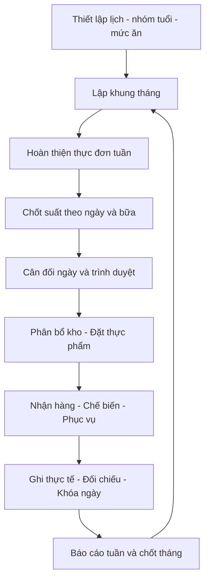

# Blueprint triển khai: Quản lý bán trú và thực đơn ngày–tuần–tháng

**Revision:** BT-1.1 · **Ngày:** 10/09/2026 · **Trạng thái:** Đặc tả đề xuất cho xây dựng và kiểm thử bằng dữ liệu giả lập; chưa có phần mềm được triển khai.

**Cập nhật BT-1.1:** đối chiếu lại giao diện QLMN; bổ sung mục 22–26 về báo cáo tháng, tính lại dây chuyền, suất cán bộ/giáo viên/nhân viên, quy cách mua và yêu cầu vận hành. Các mục bổ sung có ưu tiên cao hơn nội dung BT-1.0 nếu có khác biệt. Khi dùng prompt mẫu bên dưới, thay revision BT-1.0 bằng BT-1.1 và đọc các mục bổ sung. Xem [báo cáo đối chiếu](DOI_CHIEU_QLMN_VA_NANG_CAP_BLUEPRINT.md).

## 1. Mục đích và nguồn chuẩn

Giúp nhà trường quản lý xuyên suốt đăng ký ăn, số suất, thực đơn, cân đối khẩu phần, mua/nhận thực phẩm, phục vụ, tiền ăn và báo cáo. Người mới thực hiện được công việc theo từng bước; người lập trình có hợp đồng dữ liệu và tiêu chí kiểm chứng rõ.

Tài liệu này là đặc tả chuyên sâu cho phạm vi bán trú, bổ sung cho [blueprint toàn hệ thống](BLUEPRINT_HE_THONG_MAM_NON.md). Các quan sát QLMN và nguồn chuyên môn/pháp lý giữ tại tài liệu đó. Toàn bộ quy trình tuần/tháng, API, trạng thái và quy tắc dưới đây là **thiết kế đề xuất**, không tuyên bố là hành vi đã kiểm thử của QLMN. Những tên màn hình tham chiếu như Cân đối khẩu phần, Thực đơn mẫu, Nhập kho và Biểu mẫu thống kê đã được quan sát; khả năng lập kế hoạch tuần/tháng riêng trong phần mềm gốc chưa được xác minh.

Phạm vi lần này là **chuẩn bị vibe coding**, gồm đặc tả, backlog và prompt thực thi. Không tự xây hoặc phát hành ứng dụng trong bước xuất tài liệu.

### 1.1. Quyết định mặc định để làm bản thử

| ID | Quyết định đề xuất | Phạm vi và điểm cần xác nhận |
|---|---|---|
| DEC01 | Một trường có nhiều điểm trường; dữ liệu luôn gắn school_id | Bản thử một trường; cách ly nhiều trường phải được kiểm thử trước khi phục vụ nhiều khách hàng |
| DEC02 | Ngày là đơn vị vận hành; tuần và tháng tổ chức các ngày | Không có ba bản thực đơn ngày/tuần/tháng độc lập gây lệch dữ liệu |
| DEC03 | Tuần từ thứ Hai đến Chủ nhật; chỉ tạo suất vào ngày phục vụ | Lịch cấu hình được, ngày nghỉ không mất lịch sử |
| DEC04 | Thực đơn dự kiến tháng/tuần dùng số suất dự báo | Số suất chốt hằng ngày mới dùng đặt hàng sau phê duyệt |
| DEC05 | Công thức tính từ nguyên liệu ăn được trên một suất | Có cơ sở sống/chín và nguồn thành phần; không mặc định lượng mua là lượng ăn |
| DEC06 | Một lần tính có phiên bản và ảnh chụp toàn bộ đầu vào | Giá/công thức mới không viết lại lịch sử |
| DEC07 | Mẫu thực đơn là cấu trúc tái sử dụng, không mang theo giao dịch | Không sao chép trẻ, giá ngày, tồn, đơn đặt, thực nhận, duyệt |
| DEC08 | Chỉ gợi ý cân đối; người dùng xem trước và duyệt thay đổi | Bộ tự tối ưu nhiều ràng buộc hoãn sau MVP |
| DEC09 | Ngưỡng dinh dưỡng và tiền ăn là cấu hình được duyệt | Bản thử dùng bộ giả lập; sản xuất cần chuyên môn/kế toán xác nhận |
| DEC10 | Giữ công nghệ hiện có nếu dự án có mã nguồn | Chưa thấy ứng dụng trong workspace; chọn stack ở bước khởi tạo dự án, ghi quyết định và phiên bản khi thực hiện |

## 2. Hành trình vận hành và phạm vi MVP



**MVP bắt buộc:** dữ liệu nền; báo ăn theo bữa; mẫu món/thực đơn; lịch tháng/tuần/ngày; cân đối giải thích được; duyệt; nhu cầu mua và kho tối thiểu; nhận và thực tế; đối chiếu tiền ăn; báo cáo; quyền và lịch sử. Phần nhận hàng hỗ trợ trường tự nấu trước; mua suất ăn là biến thể có hợp đồng riêng, không tự tạo kho nguyên liệu trường.

**Sau MVP:** tối ưu tự động nâng cao, thư viện chia sẻ giữa trường, ngân hàng, URA, ký số, đấu thầu trực tuyến. Hồ sơ đấu thầu đầy đủ được đặc tả ở blueprint toàn hệ thống. MVP này chỉ cần liên kết NCC/hợp đồng/bảng giá và đơn đặt, không giả lập một hệ thống đấu thầu đã tuân thủ pháp luật.

**Chỉ số nghiệm thu sản phẩm đề xuất:** hoàn thành một tháng giả lập có ngày nghỉ và tuần giao tháng; truy ngược mọi tổng lượng/tiền về ngày và chứng từ; không có lỗi trừ kho trùng; không có truy cập ngoài quyền; người mới làm được một ngày ăn theo hướng dẫn. Thời gian thao tác mục tiêu cần đo trong thử nghiệm, chưa có baseline.

## 3. Các đối tượng phải phân biệt

| Đối tượng | Ví dụ giả lập | Công dụng |
|---|---|---|
| Nhóm tuổi | Nhóm mẫu giáo A | Chọn mục tiêu và công thức phù hợp |
| Bữa | Trưa, phụ | Xác định số suất và phạm vi dinh dưỡng |
| Nhóm chế độ ăn | Thông thường, chế độ được chỉ định | Tách công thức/phục vụ, hạn chế quyền sức khỏe |
| Lớp | Lớp A1 | Điểm danh và chốt suất |
| Điểm trường | Cơ sở A | Giao hàng, bếp, kho, báo cáo |
| Mẫu tuần | Chu kỳ tuần 1 | Khung món theo ngày tương đối, không có ngày thực tế |
| Ngày ăn | Ngày D tại cơ sở A | Chủ thể có phiên bản, duyệt và thực tế |
| Kế hoạch tuần/tháng | Phạm vi lịch | Tổng hợp và điều phối các ngày |
| Phương án | Phiên bản nháp của một ngày ăn | So sánh trước khi thay đổi chính thức |

Một trẻ có thể ăn trưa nhưng không ăn phụ. Một lớp có thể có nhiều chế độ ăn. Số suất phải lưu tại đúng giao điểm **ngày × điểm trường × nhóm tuổi × bữa × chế độ ăn**; người dùng có thể nhập tổng theo lớp, hệ thống quy về giao điểm này.

## 4. Chức năng quản lý bán trú: đầu vào–xử lý–đầu ra

| UC | Người dùng | Đầu vào | Xử lý chính | Đầu ra |
|---|---|---|---|---|
| BT01 Thiết lập | Quản trị/nghiệp vụ | Năm học, lịch, điểm trường, nhóm, bữa | Kiểm tra phạm vi/hiệu lực | Cấu hình vận hành |
| BT02 Danh sách trẻ | Giáo vụ | Hồ sơ/lớp/lịch chuyển | Duy trì lịch sử, không chuyển hồi tố ngoài quyền | Danh sách theo ngày |
| BT03 Đăng ký ăn | Giáo viên | Trẻ/bữa/ngày | Phân biệt đăng ký và có mặt | Suất dự kiến |
| BT04 Chốt báo ăn | Giáo viên/bán trú | Đăng ký, nghỉ, thời hạn | Xem thay đổi, xác nhận chốt | Phiên bản số suất |
| BT05 Điều chỉnh muộn | Bán trú | Thay đổi sau chốt | Đánh giá ảnh hưởng đặt/chế biến/tiền | Phiếu điều chỉnh có duyệt |
| BT06 Mức thu/mức thực phẩm | Kế toán | Biểu mức, khoản dịch vụ, ngày hiệu lực | Phân bổ đúng nhóm/bữa | Ngân sách được phép |
| BT07 Thực phẩm | Dinh dưỡng/kho | Thành phần, quy đổi, giá, thải bỏ | Kiểm tra nguồn, đơn vị, dữ liệu thiếu | Danh mục tính được |
| BT08 Công thức món | Dinh dưỡng | Nguyên liệu/định lượng/cách chế biến | Tính dinh dưỡng, khả thi, phiên bản | Món được duyệt |
| BT09 Mẫu ngày/tuần | Dinh dưỡng | Món/bữa/ngày tương đối | Kiểm tra phạm vi, lưu cấu trúc | Mẫu tái sử dụng |
| BT10 Kế hoạch tháng | Bán trú | Lịch, dự báo, chu kỳ mẫu | Rải mẫu, xem xung đột | Các ngày nháp được liên kết |
| BT11 Kế hoạch tuần | Dinh dưỡng | Ngày nháp, món mùa vụ, dự báo giá | Hoàn thiện, đánh giá, công bố bản phù hợp | Tuần sẵn sàng vận hành |
| BT12 Cân đối ngày | Dinh dưỡng | Suất chốt, món, mục tiêu, giá | Tính lượng/chất/tiền, điều chỉnh | Ngày được duyệt |
| BT13 Mua và kho | Mua hàng/kho | Ngày duyệt, tồn khả dụng, hợp đồng | Phân bổ, gom nhu cầu không trùng | Phiếu mua/xuất dự kiến |
| BT14 Nhận hàng | Kho/bếp | Đơn, hàng thực giao | Nhận đạt/từ chối, ghi lô | Phiếu nhận |
| BT15 Chế biến/phục vụ | Bếp | Thực nhận, lô xuất, số suất | Ghi thực dùng, thay món và số phục vụ | Hồ sơ thực tế |
| BT16 Đối chiếu ngày | Kế toán/bán trú | Suất, thực dùng, chứng từ | Kiểm tra chênh lệch và thiếu hồ sơ | Ngày khóa hoặc yêu cầu sửa |
| BT17 Theo dõi tiền ăn | Kế toán | Phải thu, thu, hoàn, tiêu dùng | Phân biệt công nợ và chi phí | Sổ tiền và số dư |
| BT18 Báo cáo/chốt tháng | Lãnh đạo/kế toán | Ngày đã đối chiếu | Tổng hợp, xác nhận, khóa kỳ | Bộ báo cáo có nguồn |

## 5. Hướng dẫn thiết lập ban đầu

### BT01 — Lịch và cấu hình

1. Chọn trường/năm học. Tạo điểm trường và kho phục vụ tương ứng.
2. Khai báo các nhóm tuổi; nhóm tuổi và bữa là hai danh mục riêng.
3. Tạo lịch phục vụ, ngày nghỉ, bữa hoạt động. Chọn ngày để xem trước số ngày phục vụ trong tháng.
4. Thiết lập thời hạn chốt suất theo bữa và quy trình điều chỉnh muộn. Bản thử không dùng một giờ mặc định như quy định thật.
5. Gán người nhập, người duyệt và người đối chiếu; kiểm tra tài khoản mẫu của từng vai trò.
6. Khai báo hồ sơ mục tiêu dinh dưỡng, ngân sách và quy tắc tiền ăn với ngày hiệu lực. Chỉ bộ được duyệt mới áp dụng cho ngày chính thức.

**Đầu ra:** màn hình kiểm tra sẵn sàng: lịch, nhóm/bữa, người phụ trách, mức ăn, dữ liệu nguồn. Thiếu mục bắt buộc hiển thị liên kết đến chỗ sửa; không chỉ báo lỗi chung “cấu hình chưa đúng”.

### BT07/BT08 — Thực phẩm và món

1. Tạo mã thực phẩm ổn định; chọn cơ sở thành phần trên 100 g hoặc 100 ml và trạng thái sống/chín.
2. Nhập P/L/G và năng lượng theo nguồn; thiếu chỉ tiêu lưu null, không tự đổi thành 0.
3. Khai báo đơn vị mua và quy đổi có căn cứ. Thải bỏ chỉ áp dụng một lần khi chuyển lượng ăn được sang lượng nguyên liệu thô.
4. Nhập giá theo đơn vị mua, nguồn giá, hiệu lực. Phân biệt giá kế hoạch, giá hợp đồng và giá thực nhận.
5. Tạo công thức món một suất theo nhóm tuổi. Mỗi dòng nhập **gam/ml ăn được trên một suất**, không nhập tổng lượng cả trường vào đây.
6. Xem tổng dinh dưỡng, tổng lượng, giá tham khảo. Kiểm tra khả năng chia phần và cách chế biến.
7. Lưu nháp → người chuyên môn duyệt → tạo phiên bản sử dụng. Sửa món đã dùng tạo phiên bản mới.

**Kiểm tra nhỏ:** công thức cho một suất tăng đôi thì chất, năng lượng và lượng nguyên liệu tăng đôi trước làm tròn; số suất lớp thay đổi không làm thay định lượng một suất.

## 6. BT03–BT05: đăng ký, chốt và điều chỉnh số suất

### Luồng người dùng

1. Giáo viên mở **Báo ăn**, chọn ngày/lớp. Hệ thống hiển thị danh sách hợp lệ tại ngày đó.
2. Chọn bữa mỗi trẻ đăng ký; ghi nghỉ hoặc ngoại lệ. Bản thử có thể nhập tổng theo lớp nếu chưa nhập danh tính trẻ, nhưng phải đánh dấu nguồn là tổng hợp.
3. Bấm **Xem tổng**: hệ thống tổng hợp theo điểm trường, nhóm tuổi và bữa, hiển thị chênh lệch với dự kiến.
4. Bấm **Chốt báo ăn**. Hệ thống tạo snapshot có người chốt và thời điểm.
5. Người lập thực đơn chọn snapshot này khi tính ngày; nếu có snapshot mới thì hiện “Số suất đã thay đổi”, không tự đổi ngày được duyệt.
6. Sau chốt, dùng **Yêu cầu điều chỉnh**: bữa, số tăng/giảm, lý do. Hệ thống cho xem tác động trước khi duyệt.

| Mốc phát hiện thay đổi | Xử lý đề xuất |
|---|---|
| Chưa duyệt ngày | Cập nhật snapshot, tính lại; giữ lịch sử |
| Đã duyệt, chưa gửi đơn | Tạo bản sửa, tính lại và duyệt lại phần bị ảnh hưởng |
| Đã gửi đơn | Tạo thay đổi đơn, chờ xác nhận NCC; không sửa mất đơn gốc |
| Đã chế biến | Ghi số phục vụ thực tế và phần dư; xử lý tiền theo chính sách |
| Đã khóa ngày | Phiếu điều chỉnh có liên kết, không sửa trực tiếp |

**Quy tắc:** điểm danh, đăng ký, suất đặt, suất giao, suất phục vụ và suất tính tiền là sáu số khác nhau. Sản phẩm có thể hỗ trợ suy ra số gợi ý, nhưng phải lưu nguồn và cho phép giải thích chênh lệch.

## 7. BT09: tạo mẫu ngày và mẫu tuần

### Mẫu ngày

Nhập tên, nhóm tuổi, chế độ ăn, các bữa, món và phiên bản công thức. Đặt nhãn mùa vụ/đặc điểm để tìm kiếm. Xem dinh dưỡng và giá tham khảo theo bộ giả định được ghi rõ. Lưu nháp và duyệt sử dụng mẫu.

### Mẫu tuần/chu kỳ

Tạo các ô ngày tương đối như thứ Hai–thứ Sáu hoặc ngày chu kỳ 1–10; gắn mẫu ngày hoặc chọn món cho từng bữa. Có thể lưu chu kỳ nhiều tuần. Khi áp dụng, người dùng phải chọn cách gặp ngày nghỉ: **giữ vị trí theo thứ** hoặc **tiến chu kỳ theo ngày phục vụ**. Mặc định bản thử giữ vị trí theo thứ; hộp xem trước phải giải thích kết quả.

**Sao chép mang theo:** món, phiên bản công thức đã chọn, ghi chú chế biến và phạm vi nhóm tuổi. **Tính lại tại ngày đích:** số suất, giá hiệu lực, hồ sơ mục tiêu, lượng mua, tồn, chi phí. **Không mang theo:** duyệt, đơn hàng, chứng từ, kết quả nhận, số phục vụ và trạng thái khóa.

Nếu một phiên bản món đã ngừng sử dụng, ngày mới yêu cầu chọn phiên bản thay; ngày cũ vẫn giữ bản lịch sử. Không tự chuyển công thức sang bản mới mà không cho xem khác biệt.

## 8. BT10: lập thực đơn tháng từng bước

**Mục đích:** nhìn trước toàn tháng, phân bổ chu kỳ món và dự báo nhu cầu; chưa phải cam kết giao hàng cả tháng.

### 8.1. Thao tác

1. Mở **Kế hoạch tháng**, chọn tháng, điểm trường, nhóm tuổi và chế độ ăn.
2. Xem lịch: ngày phục vụ, ngày nghỉ, bữa hoạt động, ngày đã có thực đơn. Xác nhận đúng phạm vi trước khi tạo.
3. Nhập số suất dự báo theo bữa hoặc chọn dữ liệu tham chiếu; hiển thị nhãn **Dự báo**, nguồn và ngày lập.
4. Chọn mẫu tuần/chu kỳ hoặc lập từng tuần. Chọn cách xử lý ngày nghỉ theo mục 7.
5. Bấm **Xem trước áp dụng mẫu**. Mỗi ngày có hành động: tạo mới, giữ nguyên, đề nghị thay hoặc không phục vụ.
6. Với ngày đã có nháp: mặc định giữ nguyên; chỉ thay khi người dùng chọn rõ từng ngày. Ngày đã duyệt/thực hiện/khóa không được ghi đè hàng loạt.
7. Xác nhận tạo. Hệ thống tạo/link các ngày nháp trong phạm vi; nếu xung đột do người khác sửa thì hủy lần áp dụng và hiển thị danh sách cần xem lại.
8. Kiểm tra đủ bữa, ngày chưa có món, món trùng theo quy tắc được cấu hình, dữ liệu thiếu, chi phí dự báo.
9. Điều chỉnh tuần có sự kiện, món theo mùa, thay nguồn thực phẩm hoặc khả năng bếp. Mọi cảnh báo phải chỉ ngày/bữa bị ảnh hưởng.
10. Bấm **Lưu kế hoạch tháng**; nếu đơn vị dùng duyệt khung tháng thì trình duyệt khung. Duyệt khung không duyệt thay cho từng ngày khi số suất/giá thay đổi.
11. Xuất **Lịch thực đơn tháng dự kiến**, **dự báo nguyên liệu** và **ngân sách dự kiến**. Báo cáo ghi rõ giả định và không lấy làm chứng từ thực nhận.

### 8.2. Quy tắc biên tháng

- Tuần giao hai tháng vẫn dùng cùng một ngày ăn, không tạo bản sao ở hai kế hoạch tháng.
- Báo cáo tháng chỉ cộng ngày nằm trong tháng; báo cáo tuần có thể chứa ngày của hai tháng.
- Thay lịch nghỉ khi chưa phát sinh giao dịch: hủy hiệu lực nháp/ngừng phục vụ có lịch sử. Đã có đơn hoặc thực tế: mở quy trình xử lý, không tự xóa.
- Tháng đang mở có thể gồm ngày khóa, ngày duyệt và ngày nháp; trạng thái tháng phải hiển thị số lượng từng loại.
- Áp lại cùng thao tác có cùng khóa chống trùng không tạo thêm ngày hoặc dòng món.

### 8.3. Đầu ra và nghiệm thu

Đầu ra là tập ngày có mã định danh, lịch và phiên bản mẫu nguồn, báo cáo dự báo theo nhóm/bữa. Hoàn thành khi mọi ngày phục vụ có khung hoặc lý do thiếu rõ ràng; không nhân đôi ngày; ngày nghỉ không phát sinh suất mặc định.

## 9. BT11: hoàn thiện thực đơn tuần từng bước

**Mục đích:** chuyển khung tháng thành kế hoạch gần thực tế hơn, kiểm tra phân bổ và chuẩn bị nguyên liệu.

1. Mở **Kế hoạch tuần**, chọn tuần và phạm vi. Các ngày được lấy từ cùng dữ liệu của kế hoạch tháng.
2. Kiểm tra số suất dự báo mới nhất, lịch sự kiện và nguyên liệu có sẵn. Số suất chưa chốt có nhãn riêng.
3. Bổ sung món còn thiếu; chọn phiên bản công thức phù hợp. Mỗi ô bữa có tên món, lượng một suất, kcal và cảnh báo.
4. Xem từng ngày trước, sau đó xem tổng hợp tuần. Không cho trung bình tuần che một ngày thiếu dữ liệu hoặc vi phạm bắt buộc.
5. Xem lặp món/lặp nguyên liệu theo chính sách nội bộ đã cấu hình. Đây là cảnh báo hỗ trợ, không tự coi mọi lần lặp là sai.
6. Xem phân bổ bữa và tính khả thi chế biến: món có cần cùng thiết bị/khâu chuẩn bị, nguyên liệu dễ hỏng, lịch giao phù hợp không. Bản MVP ghi chú và checklist, chưa cần tối ưu lịch bếp.
7. Dùng **Thay món** hoặc **Đổi hai ngày**; hệ thống cho xem khác biệt và tính lại theo giá/mục tiêu ngày đích. Chỉ đổi ngày nháp được chọn.
8. Xem **Nhu cầu nguyên liệu tuần dự kiến**. Chỉ trừ kho đã phân bổ hoặc mô phỏng theo thứ tự ngày, không trừ cùng một tồn cho mỗi ngày.
9. Trình duyệt/công bố kế hoạch tuần theo quyền. Bản công bố có phiên bản; khi đổi món phải thể hiện ngày cập nhật.
10. Trước mỗi ngày ăn, chuyển sang quy trình ngày để lấy số suất chốt, giá và tình trạng kho thực tế.

### 9.1. Tổng hợp tuần phải có hai góc nhìn

```text
Trung bình ngày đủ dữ liệu = tổng kcal/suất/ngày / số ngày đủ dữ liệu
Trung bình theo suất-bữa = Σ(kcal/suất-bữa × số suất-bữa) / Σ(số suất-bữa)
```

Hai chỉ tiêu không thay thế nhau. Không gọi trung bình theo suất-bữa là “kcal một trẻ một ngày”. Chỉ so sánh mức đáp ứng theo cùng nhóm tuổi và phạm vi bữa. Nếu thiếu ngày, hiển thị “đủ dữ liệu 4/5 ngày”; không chia cho 5 với ngày thiếu coi là 0, cũng không trình bày 4 ngày như đủ tuần.

Tỷ lệ P:L:G của một tập dữ liệu lấy tổng năng lượng từng chất chia tổng năng lượng tương ứng; không lấy trung bình đơn giản các phần trăm khi trọng số năng lượng khác nhau.

## 10. BT12: lập và cân đối khẩu phần ngày

### 10.1. Bước 1 — Chọn phạm vi

Mở ngày từ lịch tháng/tuần hoặc **Tạo ngày ăn**. Chọn điểm trường, nhóm tuổi, chế độ ăn. Hệ thống kiểm tra đã có ngày cùng phạm vi chưa; nếu có thì mở bản hiện tại thay vì tạo trùng. Hiển thị nguồn mẫu và phiên bản hiện tại.

### 10.2. Bước 2 — Lấy số suất và ngân sách

Chọn snapshot báo ăn đã chốt; xem số từng bữa, số thay đổi. Chọn mức ngân sách có hiệu lực. Ngân sách thực phẩm khác tổng khoản thu nếu có dịch vụ. Không có mức hợp lệ thì ngày vẫn nháp và bị chặn duyệt.

### 10.3. Bước 3 — Kiểm tra món và nguyên liệu

Chọn mẫu hoặc dùng kế hoạch tuần. Kiểm tra từng bữa, món và công thức. Bảng chi tiết gồm:

| Trường hiển thị | Quyền sửa đề xuất | Cách hiểu |
|---|---|---|
| Nguyên liệu, nguồn thành phần | Chọn qua công thức/phiên bản | Không sửa nguồn âm thầm trên ngày |
| Lượng ăn được một suất | Người lập nháp | Cơ sở g/ml và sống/chín rõ |
| Số suất bữa | Từ snapshot | Sửa qua quy trình báo ăn |
| Ăn được cả nhóm | Tính tự động | Định lượng × số suất |
| Thải bỏ và quy đổi | Từ phiên bản nguồn | Sai nguồn thì sửa phiên bản có lý do |
| Lượng nguyên liệu thô | Tính tự động | Chưa trừ kho |
| Lượng lấy kho/mua thêm | Phân bổ xem trước | Cùng đơn vị/cơ sở vật chất |
| Giá/chi phí | Từ bảng giá có nguồn | Giá kế hoạch chưa phải giá vốn thực tế |

### 10.4. Bước 4 — Đọc kết quả lượng, chất, tiền

Màn hình có các thẻ độc lập: năng lượng; P:L:G; chỉ tiêu bổ sung có dữ liệu; phân bổ bữa; ngân sách; lỗi dữ liệu. Mỗi thẻ chứa kết quả, mục tiêu, sai lệch, phạm vi và nguồn.

Trạng thái tiêu chí gồm **PASS, FAIL, UNKNOWN, NOT_APPLICABLE**. Tổng thể:

- Có dữ liệu bắt buộc thiếu: **INCOMPLETE**, chưa thể duyệt.
- Đủ dữ liệu nhưng vi phạm điều kiện bắt buộc: **NEEDS_CHANGE**.
- Đạt điều kiện bắt buộc nhưng còn cảnh báo: **REVIEW_REQUIRED**, cần xử lý/ghi lý do theo chính sách.
- Đạt và đủ hồ sơ: **READY_TO_SUBMIT**, vẫn chưa phải đã duyệt.

Thứ tự tính: kiểm tra dữ liệu → tính từng bữa → đánh giá theo bữa/phạm vi → tổng ngày → tiền/kho → trạng thái. Không suy luận an toàn thực phẩm chỉ từ kết quả dinh dưỡng.

### 10.5. Bước 5 — Điều chỉnh có kiểm soát

1. Xác định nguyên nhân: sai dữ liệu, sai tổng năng lượng, sai cơ cấu, sai phân bổ bữa hay vượt tiền.
2. Mở chi tiết nguyên liệu đóng góp nhiều vào chỉ tiêu lệch.
3. Tạo phương án B từ A. Chỉnh một nhóm nguyên nhân, bấm **Tính lại**.
4. Xem bảng trước/sau: kcal, P:L:G, lượng một suất, tiền, lượng mua và cảnh báo.
5. Đủ calo nhưng lệch cơ cấu: điều chỉnh tương quan nguyên liệu, không giảm đều mọi món.
6. Thiếu calo và cơ cấu phù hợp: có thể xem phương án tăng khẩu phần, nhưng phải kiểm tra khả năng ăn/chia và chi phí.
7. Vượt tiền: so sánh món/nguồn đã được duyệt; không sửa giá hoặc tiêu chuẩn không có căn cứ.
8. Chọn phương án, lưu lý do thay đổi. Phương án bỏ không phát sinh giao dịch.

### 10.6. Bước 6 — Trình duyệt

Bấm **Kiểm tra trước duyệt**: snapshot suất, giá/mục tiêu hiệu lực, công thức, dữ liệu thiếu, lượng/chất/tiền, thay món, kho dự kiến. Người duyệt xem bản chụp kết quả và thay đổi. Duyệt gắn với revision; bất kỳ thay đổi có ảnh hưởng sau đó tạo revision mới và đánh dấu cần duyệt lại. Không tự chuyển trạng thái duyệt khi chỉ in phiếu.

## 11. Hợp đồng bộ tính

### 11.1. Công thức nền

```text
P = Σ(edible_g × protein_per_100g / 100)
L = Σ(edible_g × fat_per_100g / 100)
G = Σ(edible_g × carb_per_100g / 100)
E = 4P + 9L + 4G
P% = 100 × 4P/E; L% = 100 × 9L/E; G% = 100 × 4G/E
edible_group_kg = edible_g_per_serving × servings / 1000
gross_group_kg = edible_group_kg / (1 − waste_fraction)
```

Đây là bộ tính bản thử kế thừa ví dụ trong blueprint nền; chuẩn sản xuất và hệ số thực tế cần người chuyên môn xác nhận. Dữ liệu 100 ml có đường tính riêng theo ml. waste_fraction phải trong [0,1), đơn vị quy đổi dương, định lượng không âm; giá trị 0 hợp lệ phải có ý nghĩa, không dùng thay cho null.

Không có số liệu thành phần đủ thì không tính “đạt chất”. Không có mục tiêu thì có thể hiển thị tổng tính được, nhưng đánh giá là UNKNOWN. Khoảng đạt dùng biên min/max được cấu hình rõ, so sánh giá trị chưa làm tròn; số hiển thị làm tròn không quyết định kết quả.

### 11.2. Ví dụ kiểm chứng độc lập

```text
Fixture A: P=16,25 g; L=260/9 g; G=81,25 g
E = 65 + 260 + 325 = 650 kcal
P:L:G = 10:40:50

Fixture B: mọi lượng của A nhân 0,9
E = 585 kcal; P:L:G vẫn 10:40:50

Fixture C: P=26 g; L=182/9 g; G=91 g
E = 104 + 182 + 364 = 650 kcal
P:L:G = 16:28:56
```

Các fixture là tổng chất giả lập để kiểm thử toán, không phải khẩu phần kê cho trẻ và không giả danh bảng dinh dưỡng thực phẩm thật.

### 11.3. Ví dụ lượng mua và tồn dùng chung

100 suất cần 40 g ăn được/suất, thải bỏ 20% → 4 kg ăn được, 5 kg thô. Kho khả dụng 6 kg, hai ngày cùng cần 5 kg: phân bổ theo ngày thứ nhất 5 kg, ngày thứ hai 1 kg; mua thêm tổng 4 kg. Sai nếu mỗi ngày đều trừ độc lập 6 kg rồi kết luận cả hai không cần mua.

Kho khả dụng = tồn đạt điều kiện − lượng đã giữ cho kế hoạch khác. Phiếu phân bổ chưa phải phiếu xuất; xuất thực tế mới ghi sổ. Có cơ chế hết hạn/giải phóng phân bổ khi kế hoạch thay đổi, thực hiện bằng giao dịch nhất quán.

## 12. BT13–BT18: từ ngày duyệt đến chốt tháng

### 12.1. Mua, nhận và phục vụ

1. Chọn ngày duyệt → xem nhu cầu thô → phân bổ lô khả dụng → tạo phần mua mới.
2. Gom theo NCC, hợp đồng, quy cách, điểm giao và ngày; không gom chỉ bằng tên nguyên liệu.
3. Gửi đơn theo quyền; lưu xác nhận và thay đổi. Bản thử chỉ giả lập gửi hoặc xuất tệp, không tự liên hệ NCC thật.
4. Nhận: ghi lượng giao, lượng đạt, lượng từ chối, đơn vị, lô và chứng từ. Tổng đạt+từ chối phải khớp lượng kiểm nhận trong cùng cơ sở đo.
5. Hàng lưu kho ghi nhận rồi xuất; hàng dùng trực tiếp đi theo luồng có liên kết để không tính hai lần.
6. Bếp ghi nguyên liệu thực dùng, món thực làm, suất phục vụ, phần dư và sự cố. Thay món làm tính lại dinh dưỡng thực tế cung cấp và cần người phù hợp xác nhận.
7. Hồ sơ kiểm tra/lưu mẫu lấy tham số từ quy trình được duyệt; không tự sinh kết quả “đạt” hoặc thời điểm thực hiện.

### 12.2. Đối chiếu ngày

Hiển thị các cặp: suất đăng ký/chốt/đặt/phục vụ/tính tiền; lượng kế hoạch/thực nhận/thực dùng; chi phí kế hoạch/thực dùng; hồ sơ phải có/đã có. Mỗi chênh lệch có lý do, người xử lý và trạng thái.

Ngày khóa khi các điều kiện bắt buộc được cấu hình đã hoàn thành. Nếu một khoản thanh toán NCC chưa đến hạn, ngày ăn có thể khóa nghiệp vụ theo chính sách mà công nợ vẫn mở; không buộc mọi thanh toán cùng ngày ăn.

### 12.3. Tiền ăn

Tách **phải thu**, **đã thu**, **hoàn/bù**, **chi mua**, **giá trị thực phẩm sử dụng**, **đã thanh toán NCC**. Mức thực phẩm theo suất không mặc nhiên bằng khoản thu tổng. Nghỉ đúng/muộn hạn xử lý theo chính sách có hiệu lực và phiếu điều chỉnh.

Giá trị sử dụng gồm xuất kho theo phương pháp giá vốn đã chọn và nhận dùng trực tiếp; hàng mua còn tồn không phải toàn bộ chi phí ngày ăn. Phương pháp giá vốn và cách chuyển chênh lệch là quyết định kế toán cần xác nhận trước dữ liệu thật.

### 12.4. Chốt tuần và tháng

- Tuần: xem đủ ngày/bữa, xu hướng dinh dưỡng, thực đơn đổi, chi phí và sự cố. Ngày thiếu dữ liệu phải hiện riêng.
- Tháng: kiểm tra ngày còn mở; đối chiếu kho, tiền ăn, công nợ và hồ sơ; xuất báo cáo nháp cho người phụ trách.
- Xác nhận chốt tháng khóa nghiệp vụ trong phạm vi đã chọn. Không khóa cả trường nếu chỉ đối chiếu một điểm trường mà chính sách yêu cầu toàn trường.
- Điều chỉnh sau khóa qua chứng từ liên kết và kỳ ghi nhận phù hợp; không xóa lịch sử báo cáo đã phát hành.

## 13. Đặc tả màn hình để dựng giao diện

| Screen | Thành phần bắt buộc | Hành động chính | Trạng thái phải thiết kế |
|---|---|---|---|
| S01 Tổng quan | Ngày/phạm vi, việc cần làm, ngày thiếu | Đi đến bước đang chờ | Không dữ liệu, thiếu quyền, lỗi tải |
| S02 Báo ăn | Lớp/bữa, dự kiến/chốt, chênh lệch | Lưu nháp, chốt, điều chỉnh | Chưa chốt, đã chốt, quá hạn |
| S03 Danh mục | Nguồn/phiên bản/hiệu lực, bảng lỗi | Tạo/sửa phiên bản, nhập xem trước | Thiếu thành phần, ngừng dùng |
| S04 Công thức | Nguyên liệu một suất, tính thử | Nhân bản, trình duyệt | Nháp, đang dùng, bị thay thế |
| S05 Mẫu | Khung ngày/chu kỳ, phạm vi | Áp dụng xem trước | Món hết hiệu lực, không tương thích |
| S06 Tháng | Lưới lịch, tổng ngày theo trạng thái | Rải mẫu, lọc, xem trước, xuất | Ngày nghỉ, xung đột, đã khóa |
| S07 Tuần | Ngày × bữa, số liệu và cảnh báo | Thay món, đổi ngày, dự báo mua | Thiếu ngày, tuần giao tháng |
| S08 Ngày | Năm bước, bảng nguyên liệu, thẻ đánh giá | Tính lại, so sánh, trình duyệt | Đang tính, lỗi dữ liệu, revision cũ |
| S09 Duyệt | Snapshot, khác biệt, lý do | Duyệt, trả sửa | Hết quyền, dữ liệu đã đổi |
| S10 Mua/kho | Phân bổ, đặt, nhận, giao dịch | Tạo đơn, nhận, xuất | Thiếu tồn, nhận phần, gửi lặp |
| S11 Thực tế | Món/lượng/suất/hồ sơ | Ghi thực tế, yêu cầu điều chỉnh | Chưa đủ hồ sơ, sự cố |
| S12 Đối chiếu | Kế hoạch–thực tế, tiền, chênh lệch | Xử lý, khóa, xuất | Chưa khớp, khóa, điều chỉnh |

Thanh đầu luôn hiển thị ngày/điểm trường/nhóm tuổi. Không đặt tên nút “Lưu” cho hành động vừa lưu vừa xuất kho. Tách rõ **Lưu nháp**, **Trình duyệt**, **Ghi sổ**. Hỗ trợ bàn phím, lỗi cạnh trường nhập và trạng thái có chữ ngoài màu. Khi điều hướng khỏi bản sửa chưa lưu, cho chọn lưu nháp hoặc bỏ thay đổi.

## 14. Mô hình dữ liệu tối thiểu

| Entity | Trường chính | Ràng buộc |
|---|---|---|
| ServiceCalendar | school_id, campus_id, date, meal_slot_id, active, revision | Unique phạm vi/ngày/bữa |
| MealCountSnapshot | id, school_id, date, scope, revision, status, source | Bất biến sau chốt; tạo bản mới |
| MealCountLine | snapshot_id, campus, age_group, diet_group, meal_slot, count | Unique giao điểm, count ≥ 0 |
| NutritionProfileVersion | id, scope, effective_from/to, metrics, approval | Không chồng hiệu lực cùng phạm vi |
| FoodVersion | id, food_id, basis_unit, state, nutrients, waste, conversion, source | null khác 0; đơn vị có chiều |
| RecipeVersion/Line | recipe_id, age_scope, food_version_id, edible_quantity | Lượng theo một suất, snapshot phiên bản |
| MenuTemplateVersion | template_id, day_offsets, meals, recipe_versions | Không chứa giao dịch |
| MealDay | id, school_id, campus, date, age_group, diet_group, current_revision | Unique phạm vi; nhiều bữa nằm trong ngày |
| MealDayRevision | day_id, revision, counts_snapshot, profile_version, status | Bất biến sau duyệt; có parent_revision |
| MealDayLine | revision_id, meal_slot, recipe_version, food_version, edible_qty | Dòng phân biệt món dù cùng nguyên liệu |
| CalculationRun | id, revision_id, input_hash, engine_version, totals, diagnostics | Đầu vào thay đổi thì kết quả cũ không dùng duyệt |
| PeriodPlan | school_id, campus, period_type, start/end, revision, status | Chỉ liên kết ngày, không copy giao dịch |
| PeriodPlanDay | period_id, day_id, source_template_version | Một liên kết duy nhất mỗi period/day |
| StockLot/Reservation | lot_id, qty, unit, status, day_revision_id | Cấp phát trong transaction, không vượt khả dụng |
| StockTransaction | id, lot_id, type, qty, cost, reference, reversal_of | Ghi sổ không sửa đè; chống trùng tham chiếu |
| PurchaseOrder/Receipt | contract_id, delivery_date, lines, accepted/rejected | Giá/ĐVT có snapshot, nhận nhiều lần được |
| ServiceActual | day_id, meal_slot, served_count, actual_lines, waste_note | Không ghi đè kế hoạch |
| MealFinanceEntry | scope, date, type, amount, reference, policy_version | Phải thu/thu/hoàn/tiêu dùng riêng |
| Approval/AuditEvent | object_id, revision, actor, action, reason, timestamp | Gắn đúng revision và phạm vi |

Khóa ngoại phải bảo đảm cùng school_id, không chỉ kiểm tra ở giao diện. Phân quyền áp dụng cả truy vấn, tệp xuất và tác vụ nền. Múi giờ hiển thị Asia/Ho_Chi_Minh; ngày phục vụ lưu kiểu ngày địa phương, thời điểm thao tác lưu UTC. Tuần dùng ngày bắt đầu làm định danh để tránh nhập nhằng số tuần ở đầu năm.

## 15. Hợp đồng thao tác/API đề xuất

Đây là giao diện cho phần mềm mới, không phải API của QLMN. Thay đường dẫn theo quy ước dự án nếu có, nhưng giữ hành vi và ràng buộc.

| Thao tác | Request chính | Response/điều kiện |
|---|---|---|
| POST /meal-counts/{id}/freeze | expectedRevision | Snapshot chốt, không sửa tại chỗ |
| POST /period-plans/preview | scope, range, templateVersion, holidayMode, conflictPolicy=keep | Danh sách ngày tạo/giữ/xung đột, previewToken |
| POST /period-plans/apply | previewToken, idempotencyKey | Tạo liên kết/ngày trong một giao dịch; 409 nếu stale |
| POST /meal-days | scope, date, templateVersion | Ngày nháp hoặc 409 kèm id ngày đã có |
| PATCH /meal-days/{id}/draft | expectedRevision, changes | Revision mới; kiểm tra quyền/trạng thái |
| POST /meal-days/{id}/calculate | expectedRevision | calculationId, inputHash, engineVersion, metrics, diagnostics |
| POST /meal-days/{id}/submit | expectedRevision, calculationId | Chặn tính cũ hoặc lỗi bắt buộc |
| POST /meal-days/{id}/approve | expectedRevision, decision, reason | Bản duyệt đúng revision; kiểm tra vai trò |
| POST /stock/reservations/preview | approvedDayRevisionIds | Phân bổ giả lập tuần tự, chưa ghi sổ |
| POST /stock/reservations/commit | previewToken, idempotencyKey | Phân bổ nguyên tử hoặc báo thiếu mới phát sinh |
| POST /receipts/{id}/post | expectedRevision, idempotencyKey | Chứng từ/giao dịch liên kết duy nhất |
| POST /meal-days/{id}/close | expectedRevision, reconciliationId | Khóa hoặc trả danh sách chưa hoàn thành |
| GET /reports/menu | from, to, scope, basis=planned/actual | Kết quả, phiên bản, độ đầy đủ, bộ lọc |

Mã lỗi thống nhất: 400 sai cấu trúc; 401 chưa đăng nhập; 403 thiếu quyền; 404 ngoài phạm vi/không tồn tại theo chính sách chống lộ; 409 xung đột revision/trạng thái; 422 vi phạm nghiệp vụ. Lỗi có code ổn định, thông điệp tiếng Việt, đường dẫn trường và hành động khắc phục.

### Payload lỗi mẫu

```json
{
  "code": "STALE_CALCULATION",
  "message": "Số suất đã thay đổi. Hãy tính lại trước khi trình duyệt.",
  "currentRevision": 8,
  "actions": ["RELOAD_COUNTS", "RECALCULATE"]
}
```

### Kết quả tính mẫu

```json
{
  "engineVersion": "demo-1",
  "revision": 3,
  "status": "NEEDS_CHANGE",
  "metrics": {
    "energyKcalPerServing": "650",
    "proteinEnergyPercent": "10",
    "fatEnergyPercent": "40",
    "carbEnergyPercent": "50"
  },
  "diagnostics": [
    {"code": "PROFILE_RATIO_MISMATCH", "severity": "blocking", "scope": "demo-profile"}
  ]
}
```

Số thập phân có thể truyền dạng chuỗi để bảo toàn chính xác; phải dùng thống nhất đầu/cuối hệ thống. Payload trên chỉ minh họa bộ giả lập, không chứa tiêu chuẩn sản xuất.

## 16. Trạng thái và quyền

```text
Ngày: DRAFT → SUBMITTED → APPROVED → IN_PROGRESS → RECONCILING → CLOSED
              ↓ trả sửa
            DRAFT (revision mới)

Tháng/tuần: DRAFT → REVIEWED → PUBLISHED (khung đã công bố)
Khóa kỳ kế toán/nghiệp vụ là hành động riêng, không suy từ PUBLISHED.
```

| Hành động | Giáo viên | Dinh dưỡng | Kho/bếp | Kế toán | Người duyệt |
|---|---|---|---|---|---|
| Báo ăn lớp được giao | Có | Xem tổng | Xem tổng | Xem tổng | Xem |
| Sửa món/khẩu phần nháp | Không | Có | Đề nghị | Không | Theo phân công |
| Trình duyệt | Không | Có | Không | Không | Theo phân công |
| Duyệt khẩu phần | Không | Theo quyền riêng | Không | Không | Có |
| Nhận/xuất/thực tế | Không | Xem/đề nghị | Có | Xem | Xem |
| Đối chiếu tiền | Không | Xem phù hợp | Xem phù hợp | Có | Duyệt |
| Khóa/mở điều chỉnh | Không | Không mặc định | Không | Đề nghị | Theo thẩm quyền |

Không mặc định tài khoản quản trị kỹ thuật có quyền duyệt chuyên môn. Nếu cho kiêm nhiệm, phải cấu hình rõ. Ghi nhật ký mọi thao tác trọng yếu và lý do trả sửa/điều chỉnh.

## 17. Bộ kiểm thử nghiệm thu cho vibe coding

Toàn bộ dưới đây **Not run**: là yêu cầu kiểm thử, chưa có ứng dụng để chạy. Mỗi lần thực hiện phải ghi revision mã nguồn và kết quả thật.

| AC | Given / When | Then | Loại |
|---|---|---|---|
| AC01 | Cùng phạm vi/ngày được tạo hai lần | Một ngày, trả mã đã tồn tại/xung đột rõ | Integration |
| AC02 | Rải mẫu vào tháng có ngày nghỉ | Ngày nghỉ không có suất mặc định; preview đúng | E2E |
| AC03 | Tuần có ngày ở hai tháng | Ngày chỉ một bản; tổng tháng lọc đúng ngày | Integration |
| AC04 | Áp mẫu gặp ngày đã duyệt | Không ghi đè; hiện danh sách giữ/xung đột | E2E |
| AC05 | Áp lại với cùng idempotencyKey | Không tạo thêm ngày/món | Integration |
| AC06 | Giá/mục tiêu ngày đích khác ngày mẫu | Sao chép tính theo ngày đích, không mang giao dịch | Integration |
| AC07 | Trưa 100, phụ 90 suất | Nguyên liệu từng bữa theo đúng số | Unit |
| AC08 | Thay số suất sau calculate | Submit từ chối kết quả stale | Integration |
| AC09 | Fixture A/B/C | Khớp kết quả mục 11 trong sai số thập phân quy định | Unit |
| AC10 | 40 g × 100, thải bỏ 20% | 4 kg ăn được, 5 kg thô | Unit |
| AC11 | 180 ml, thành phần theo 100 ml | Không cần/không tự tạo quy đổi g | Unit |
| AC12 | Dữ liệu null hoặc E=0 | Không chia 0; UNKNOWN/INCOMPLETE | Unit |
| AC13 | Chỉ tiêu đúng ngay min/max | Quy tắc biên dùng số chưa làm tròn | Unit |
| AC14 | Tồn 6 kg, hai ngày cần 5+5 | Phân bổ 5+1, mua 4; không dùng trùng tồn | Integration |
| AC15 | Hai người cùng giữ tồn | Tổng giữ không vượt khả dụng | Concurrency |
| AC16 | In phiếu dự kiến | Không phát sinh xuất kho | Integration |
| AC17 | Bấm ghi sổ hai lần | Một giao dịch hữu hiệu | Integration |
| AC18 | Nhận dùng ngay | Không tính hai lần giá trị tiêu dùng | Integration |
| AC19 | Tuần 5 ngày thiếu một | Hiển thị 4/5, không giả đủ dữ liệu | E2E |
| AC20 | Tỷ lệ ngày có trọng số khác nhau | Tổng P:L:G theo tổng năng lượng, không trung bình % sai | Unit |
| AC21 | Đổi món ngày đã duyệt | Bản sửa cần tính/duyệt lại, giữ bản cũ | E2E |
| AC22 | Nghỉ sau đã gửi đơn | Phiếu điều chỉnh, đơn cũ không mất | E2E |
| AC23 | Người trường A đọc/xuất dữ liệu trường B | Bị từ chối cả API/tệp | Security |
| AC24 | Giá/công thức thay sau khóa | Báo cáo cũ giữ nguyên | Integration |
| AC25 | Khóa tháng có ngày chưa đủ hồ sơ bắt buộc | Trả danh sách thiếu, không báo thành công | E2E |
| AC26 | Khôi phục dữ liệu/tệp từ bản sao | Tổng kho/tiền và liên kết hồ sơ khớp | Recovery |
| AC27 | Hai người áp mẫu từ preview cũ | 409 và xem trước lại, không cập nhật một phần | Concurrency |
| AC28 | Thu tiền chưa đủ nhưng ngày phục vụ đã đối chiếu | Công nợ riêng, xử lý khóa theo chính sách | Integration |

## 18. Backlog build theo lát cắt hoàn chỉnh

Owner dưới đây là vai trò đề xuất, chưa phải tên người đã nhận việc. Chưa ước lượng thời gian vì chưa chốt người thực hiện và công nghệ. Mỗi lát cắt phải có UI + xử lý server + lưu trữ + kiểm thử tương ứng, không chỉ dựng màn hình đẹp.

| Task | Kết quả demo | Spec/AC | Phụ thuộc | Owner | Trạng thái/bằng chứng |
|---|---|---|---|---|---|
| VC00 | Khởi tạo môi trường, đăng nhập, phạm vi trường, dữ liệu giả | Mục 14/16, AC23 | Chọn stack theo dự án | Dev/QA | Proposed; chưa có |
| VC01 | Một món tính được và có giải thích | Mục 5/11, AC09–13 | VC00; bộ giả lập | Dev + chuyên môn | Proposed; chưa có |
| VC02 | Báo ăn → một ngày nháp → tính → duyệt | Mục 6/10, AC01,07,08,21 | VC01 | Dev/QA + bán trú | Proposed; chưa có |
| VC03 | Mẫu tuần → tháng → mở ngày, không nhân đôi | Mục 7–9, AC02–06,27 | VC02 | Dev/QA | Proposed; chưa có |
| VC04 | Tổng hợp tuần/tháng có độ đầy đủ | Mục 9/13, AC19,20 | VC03 | Dev/QA | Proposed; chưa có |
| VC05 | Ngày duyệt → giữ kho → nhu cầu mua | Mục 11/12, AC14–16 | VC02 | Dev + kho | Proposed; chưa có |
| VC06 | Nhận → xuất/thực tế → đối chiếu ngày | Mục 12, AC17,18,22 | VC05 | Dev + kho/kế toán | Proposed; chưa có |
| VC07 | Tiền ăn → công nợ → khóa tháng → báo cáo | Mục 12, AC24,25,28 | VC04/VC06; chính sách tiền | Dev + kế toán | Proposed; chưa có |
| VC08 | Thử đủ tháng, quyền, phục hồi và hướng dẫn | Mục 17, AC23/26 + regression | VC07 | QA + triển khai | Proposed; chưa có |

### 18.1. VC01 — phiếu triển khai chi tiết

- Mục tiêu: nhập một công thức, nhìn đúng năng lượng và tỷ lệ, biết thiếu dữ liệu ở đâu.
- UI: danh mục thực phẩm giả lập; công thức một suất; kết quả và diagnostics.
- Server: kiểm tra đơn vị, null, thải bỏ và phiên bản; engine có version.
- Dữ liệu: migration cho food/recipe/profile versions; seed gắn nhãn DEMO, không trộn dữ liệu thật.
- Tests: AC09–13; thêm test sửa phiên bản không làm đổi bản cũ.
- Phục hồi: migration phát triển có kế hoạch quay lại; không xóa dữ liệu thật để chạy lại seed.
- Done: thao tác qua UI lưu được, tải lại còn dữ liệu, tính khớp fixture, lỗi thiếu dữ liệu có thông điệp, ghi kết quả test và revision.

### 18.2. VC02 — phiếu triển khai chi tiết

- Mục tiêu: một ngày từ báo ăn đến duyệt với số suất từng bữa đúng.
- UI: báo ăn tổng hợp theo lớp/phạm vi, ngày ăn năm bước, màn hình duyệt.
- Server: snapshot suất, revision, calculate, submit, approve; phân quyền và trạng thái.
- Dữ liệu: unique phạm vi/ngày, calculation input hash, approval theo revision.
- Tests: AC01,07,08,21,23; lưu hai bản cạnh tranh phải báo xung đột.
- Migration: thêm bảng mới, không backfill hồ sơ đã duyệt bằng cấu hình hiện tại nếu thiếu nguồn.
- Done: demo số suất thay đổi làm kết quả cũ hết hiệu lực; người không có quyền không duyệt được; không chỉ giả lập trạng thái ở trình duyệt.

### 18.3. VC03 — phiếu triển khai chi tiết

- Mục tiêu: tạo tháng từ mẫu tuần và sửa một ngày an toàn.
- UI: lịch tháng, tuần, preview áp mẫu có checkbox phạm vi và danh sách xung đột.
- Server: preview token chứa hash lịch/template/revision; apply nguyên tử; idempotency.
- Dữ liệu: period liên kết canonical day; snapshot nguồn mẫu.
- Tests: AC02–06,27; lịch nghỉ với cả hai chế độ chu kỳ; tuần giao năm/tháng.
- Done: sửa một ngày thấy nhất quán ở tuần/tháng; rải lại không ghi đè ngày duyệt; xuất đúng phạm vi.

### 18.4. Chuẩn hoàn thành chung

Trạng thái task: Proposed → Ready → In progress → In review → Verified. Chỉ chuyển Ready khi phụ thuộc và hành vi đủ rõ; Verified phải có kết quả kiểm chứng. Ready for Release cần thêm cấu hình, dữ liệu, quyền, phục hồi và vận hành; Released chỉ ghi sau phát hành thật được cho phép. Tài liệu này không đặt sẵn các trạng thái đó.

## 19. Prompt chuẩn để bắt đầu vibe coding

Sao chép khối dưới vào công cụ lập trình **khi bắt đầu xây dự án**, kèm hai tệp blueprint. Đây là prompt chuẩn bị, chưa phải ghi nhận đã xây.

```text
Bạn triển khai sản phẩm quản lý bán trú theo BLUEPRINT_VIBE_CODING_BAN_TRU.md
revision BT-1.0; dùng BLUEPRINT_HE_THONG_MAM_NON.md làm ngữ cảnh nền.

Trước khi sửa: đọc AGENTS.md nếu có, kiểm tra mã nguồn/stack hiện hữu và build plan.
Giữ quy ước dự án. Nếu chưa có dự án, đề xuất và ghi quyết định stack phù hợp
đội ngũ/môi trường; không tự thêm dịch vụ bên ngoài hoặc triển khai công khai.

Bắt đầu VC00 rồi VC01 theo phụ thuộc. Chỉ dùng dữ liệu DEMO rõ nhãn.
Không lấy dữ liệu trẻ thật hoặc tự đặt tiêu chuẩn dinh dưỡng sản xuất.
Mỗi lát cắt phải chạy xuyên UI, server và database, có kiểm tra quyền server.

Tuân thủ: một ngày là nguồn dữ liệu chung cho tuần/tháng; snapshot và revision;
null khác 0; g khác ml; lượng ăn khác lượng mua; dự báo khác thực tế;
in không ghi sổ; ghi sổ có chống trùng; khóa không sửa đè.

Trước mỗi lát cắt, nêu spec/AC/phụ thuộc. Thực hiện đầy đủ, chạy kiểm thử
tương ứng, sửa lỗi, ghi evidence theo revision vào build-plan.md.
Không đánh dấu Verified khi chỉ sinh file hoặc dựng UI.
Kết thúc mỗi lát cắt báo cách chạy/demo, kiểm tra đã chạy, phần chưa xác minh
và bước tiếp theo. Không mở rộng sang tối ưu AI, URA, ngân hàng hay đấu thầu
nếu chưa thuộc lát cắt được giao.
```

### Prompt giao từng lát cắt

```text
Thực hiện VC02 của BT-1.0 sau khi xác nhận VC01 đã Verified.
Đọc lại mục 6, 10, 14–16 và AC01/07/08/21/23.
Làm trọn luồng báo ăn → ngày nháp → tính → trình → duyệt.
Bao gồm UI, server, migration, seed DEMO, test và hướng dẫn thử.
Nếu gặp quyết định nghiệp vụ còn mở, tách phần giả lập rõ ràng;
không biến giả định thành chuẩn cho dữ liệu thật.
Cập nhật build-plan.md với revision và kết quả thực chạy.
```

```text
Thực hiện VC03 của BT-1.0 sau khi VC02 đã Verified.
Mục tiêu: rải mẫu tuần vào tháng có ngày nghỉ, sửa ngày nháp,
không ghi đè ngày duyệt và không tạo ngày trùng ở tuần giao tháng.
Triển khai preview/apply có kiểm tra stale và idempotency.
Chạy AC02–06 và AC27; demo sửa một ngày phản ánh ở cả ba lịch.
```

### Prompt kiểm tra trước khi mở rộng

```text
Rà soát bản hiện tại theo AC01–AC28 của BT-1.0.
Ghi rõ Not run/Pass/Fail cho từng AC và revision đã kiểm tra.
Ưu tiên sai số, null/đơn vị, số suất từng bữa, ngày trùng,
snapshot sau duyệt, tồn dùng chung, quyền ngoài trường và dữ liệu sau khóa.
Sửa lỗi trong phạm vi đã triển khai; không xây phân hệ mới để che lỗi.
Xuất báo cáo kiểm chứng và những điều kiện còn thiếu trước pilot.
```

## 20. Điểm còn mở và người cần xác nhận

| ID | Nội dung | Owner đề xuất | Chặn bước nào |
|---|---|---|---|
| O01 | Bộ mục tiêu, ngưỡng, hệ số, phạm vi bữa/tuổi | Phụ trách dinh dưỡng | Dữ liệu thật và duyệt sản xuất; không chặn fixture |
| O02 | Mức thu, mức thực phẩm, nghỉ muộn, chuyển chênh lệch | Kế toán + lãnh đạo | VC07 cho dữ liệu thật |
| O03 | Phương pháp giá vốn, nhập dùng ngay, khóa kỳ | Kế toán/kho | VC06–07 sản xuất |
| O04 | Người có quyền duyệt và chính sách kiêm nhiệm | Nhà trường | Pilot |
| O05 | Quy trình an toàn, biểu mẫu và tham số áp dụng | Phụ trách chuyên môn | Hồ sơ bếp thật |
| O06 | Stack, môi trường, nguồn lực, tên người nhận việc | Người chủ trì kỹ thuật | VC00 triển khai |
| O07 | Tích hợp báo ăn, URA, dữ liệu cũ | Chủ sản phẩm | Chỉ giai đoạn tích hợp, không chặn nhập tổng hợp DEMO |
| O08 | Thực tế trường tự nấu/mua suất/nấu thuê tại chỗ | Chủ sản phẩm + mua sắm | Nhánh vận hành hợp đồng tương ứng |

## 21. Thử nghiệm và bàn giao

Chuẩn bị một bộ DEMO có hai điểm trường, hai nhóm tuổi, số suất khác nhau giữa bữa, một ngày nghỉ, một tuần giao tháng, một thực phẩm thiếu dữ liệu, một giá đổi hiệu lực, hai ngày dùng chung tồn, một lần nhận thiếu và một lần điều chỉnh muộn. Không dùng thông tin cá nhân thật.

Chạy theo thứ tự: công thức → ngày → tuần/tháng → kho → thực tế → tiền → khóa → báo cáo → quyền → phục hồi. Đối chiếu một số ví dụ tính tay độc lập; không chỉ so kết quả giữa hai màn hình dùng cùng công thức.

Khi đủ điều kiện pilot: nhập cấu hình và dữ liệu đã xác nhận; có tài khoản theo vai trò; kiểm tra khôi phục; đào tạo bằng chu trình một ngày; xác định người hỗ trợ và điều kiện dừng khi sai số/quyền. Việc phát hành chỉ thực hiện trong yêu cầu triển khai riêng, không được suy từ tài liệu chuẩn bị.

**Trạng thái bàn giao hiện tại:** đã có blueprint nghiệp vụ và hợp đồng thiết kế; chưa có mã ứng dụng, migration hay test ứng dụng được chạy. Việc tiếp theo khi bắt đầu xây là VC00, sau đó VC01; chưa cần xây tất cả phân hệ cùng lúc.

## 22. Danh mục báo cáo chi tiết — bổ sung BT-1.1

Các tên báo cáo dưới đây được quan sát trong menu QLMN ngày 10/09/2026. Chưa mở/xác minh toàn bộ nội dung tệp xuất; cấu trúc dữ liệu và kiểm soát sau đây là đề xuất cho sản phẩm mới. Không coi danh mục nút là bằng chứng công thức báo cáo.

| Report ID | Tên/phạm vi | Đầu vào đề xuất | Đầu ra và kiểm tra |
|---|---|---|---|
| RP01 | Theo dõi chất lượng bữa ăn tháng | Ngày đủ dữ liệu, mục tiêu theo phiên bản | Chỉ tiêu từng ngày, số ngày đủ/thiếu; không chỉ trung bình tháng |
| RP02 | Chất lượng bữa ăn – kiểm kê cuối tháng | RP01 và biên bản tồn thực tế | Hai phần có căn cứ riêng; chênh tồn không sửa chỉ tiêu dinh dưỡng |
| RP03 | Quyết toán tiền ăn | Ngân sách, thực phẩm sử dụng, điều chỉnh, số dư | Đầu kỳ + phát sinh theo quy ước = cuối kỳ; công thức kế toán cần duyệt |
| RP04 | Tiền dịch vụ | Suất tính phí và chính sách hiệu lực | Chi tiết khoản dịch vụ; không cộng trùng ngân sách thực phẩm |
| RP05 | Bảng kê thực phẩm | Dòng thực phẩm kế hoạch hoặc thực tế được chọn | Mã/quy cách/đơn vị/lượng/giá trị, cùng phạm vi |
| RP06 | Bảng kê chi tiết tiền ăn | Số suất và dòng tiền theo ngày/phạm vi | Truy về chứng từ, phân biệt phải thu và tiêu dùng |
| RP07 | Tổng hợp suất ăn theo STTA | Nguồn sổ tính tiền ăn cần xác minh nghĩa STTA | Bản thử ghi tên đầy đủ đã xác nhận, không đoán cách lấy số |
| RP08 | Bảng kê chi mua thực phẩm | Chứng từ mua/nhận và trạng thái | Chi mua khác giá trị xuất dùng; ghi cơ sở ngày chứng từ |
| RP09 | Thực đơn tuần | Ngày/bữa/nhóm và phiên bản công bố | Tuần giao tháng đúng phạm vi; ngày nghỉ có nhãn |
| RP10 | Calo tuần | Ngày/bữa/nhóm được chọn | Hiển thị bộ lọc bữa; không dùng kho như bản chất của nhóm tuổi |
| RP11 | Bộ sổ mẫu | Phiên bản mẫu, đơn vị phát hành, phạm vi | Phân biệt mẫu trống với hồ sơ đã ghi nhận thực hiện |
| RP12 | Hồ sơ bữa ăn CBGVNV | Suất người lớn và chính sách riêng | Không dùng chuẩn trẻ em, không trộn nguồn tiền/chi phí |

Cấu hình xuất gồm: gộp/tách nhóm trẻ, điểm trường, khoảng ngày, kế hoạch/thực tế, mẫu biểu và phiên bản. QS: QLMN có tùy chọn tách nhóm trước khi xem/in phiếu kê chợ/kiểm thực, và mở thêm mẫu Bảng đi chợ. DX: preview phải hiển thị bộ lọc, tổng lượng/tiền và số nhóm; tổng các bản tách phải khớp bản gộp cùng phạm vi.

Mỗi lần xuất lưu report_run_id, input_revision/hash, template_version, actor, generated_at, phạm vi và trạng thái dữ liệu. Bản xuất không ghi sổ. Đường tải phải kiểm tra quyền tại lúc tải, không chỉ lúc tạo. Có thể chọn PDF hoặc bảng tính trong thiết kế; chưa khẳng định hệ thống gốc xuất đủ mọi định dạng.

## 23. Tính lại dây chuyền và dữ liệu báo cáo cũ

QS: phiếu kê chợ có tooltip “Xóa và cập nhật lại phiếu kê chợ từ điều chỉnh”; sổ tiền ăn có thao tác “Xóa sổ từ ngày…”. Không thực hiện các thao tác này khi khảo sát. Chưa xác nhận cơ chế liên ngày hoặc dữ liệu bị xóa thực tế.

DX: thay thao tác mơ hồ bằng **Xem ảnh hưởng và tạo bản tính lại**:

1. Chọn chứng từ/ngày nguồn cần sửa; bắt buộc lý do và expectedRevision.
2. Hệ thống xác định đối tượng phụ thuộc: kết quả tính, phân bổ, phiếu chợ, đơn chưa gửi, sổ ngày, số dư chuyển, báo cáo tuần/tháng.
3. Phân loại: bản nháp có thể tính lại; đơn đã gửi cần điều chỉnh; ngày/kỳ khóa cần hồ sơ điều chỉnh; bản xuất cũ giữ nguyên và đánh dấu đã được thay thế khi phù hợp.
4. Preview hiển thị trước/sau, từ ngày nào đến ngày nào và tổng tiền/lượng thay đổi. Nếu chính sách không chuyển số dư thì không tự tính lại mọi ngày sau.
5. Người có quyền xác nhận. Xử lý theo nhóm giao dịch nguyên tử hoặc tác vụ có checkpoint; không công bố báo cáo “mới” khi chỉ tính xong một phần.
6. Lưu quan hệ supersedes, phiên bản và lịch sử. Thất bại giữ bản hiện hành, cho thử lại chống trùng. Không xóa chứng từ gốc để dựng lại.

Thêm CalculationDependency(source_type/id/revision, dependent_type/id/revision), RecalculationJob(scope, impact_hash, status, checkpoint, result_version). Dữ liệu thay đổi sau preview trả 409, yêu cầu xem lại. Đây là bổ sung VC06/VC07, không phải viết lại engine không kiểm soát.

## 24. Khoảng trống dữ liệu và kiểm soát cần bổ sung

### 24.1. Suất CBGVNV và nhóm người hưởng

QS chỉ xác nhận đường tải sổ “QL bữa ăn CBGVNV”, chưa xác nhận màn hình quản lý riêng. DX thêm beneficiary_type = CHILD/STAFF; STAFF không yêu cầu age_group trẻ, có hồ sơ ngân sách và đánh giá phù hợp riêng. Tách khóa duy nhất ngày ăn theo loại người hưởng; cập nhật API, lọc báo cáo và quyền. Nguyên liệu mua có thể gom theo quy cách nhưng phân bổ giá trị phải truy về từng loại; không dùng tiền trẻ bù suất người lớn ngầm.

### 24.2. Quy cách mua và làm tròn

Lưu purchase_increment, minimum_order, package_net_quantity, measurement_dimension, rounding_policy. Ví dụ giả lập cần 3,5 kg, quy cách 2 kg/gói: mua 2 gói = 4 kg, sử dụng dự kiến 3,5 kg và phần 0,5 kg có đích tồn/dư rõ ràng. Không nâng lượng dinh dưỡng một trẻ chỉ vì mua nguyên gói. Nếu chính sách cho mua lẻ, không tự làm tròn thành gói. Mọi số liệu gom mua phải cùng food/spec/unit; không cộng ml và g.

### 24.3. Cập nhật dữ liệu nguồn

Trước cập nhật thành phần/quy đổi hoặc giá từ thư viện: xem trước dòng thêm/sửa, nguồn, phiên bản và tác động tới nháp tương lai. Giữ trường tùy chỉnh có chủ đích theo chính sách merge được chọn. Món đang dùng bị ảnh hưởng được gắn cần rà soát; không ghi đè bản đã duyệt. Import có dry-run, kiểm tra trùng mã, đơn vị, null, giá 0 và báo lỗi từng dòng; dữ liệu mẫu giả lập không được chuyển trạng thái nguồn chính thức.

### 24.4. Phân biệt kho và bữa

QS: calo tuần có bộ lọc Kho sáng/Kho trưa. DX: kho là vị trí quản lý vật chất; bữa là phạm vi phục vụ. Nếu nhập dữ liệu cũ, cần bảng ánh xạ có xác nhận, không hard-code kho sáng = bữa sáng trong mọi trường. Một kho có thể cấp nhiều bữa; một bữa có thể dùng nhiều kho.

## 25. Yêu cầu vận hành đo được và mức sẵn sàng

Các con số sau là **mục tiêu kỹ thuật đề xuất cho thử tải**, chưa phải cam kết hoặc kết quả đã đo: bộ thử một trường, 3 điểm trường, 1.000 suất/ngày, 31 ngày/tháng, 20 phiên đồng thời. Chốt lại với người vận hành trước pilot.

| Chỉ tiêu | Mục tiêu đề xuất | Cách kiểm tra |
|---|---|---|
| Mở lịch tháng | p95 ≤ 2 giây sau xác thực, không gồm mạng người dùng | Kịch bản 31 ngày với dữ liệu mẫu xác định |
| Tính một ngày | p95 ≤ 2 giây với 100 dòng nguyên liệu | Đo cả server, báo engine/version và dữ liệu thử |
| Xuất tháng | Có tiến độ/hủy khi quá 5 giây; đích hoàn thành ≤ 30 giây ở bộ thử | Không khóa UI hoặc trả file thiếu |
| Tính nhất quán | Không mất cập nhật/không ghi sổ trùng | Kiểm thử đồng thời và thử lại sau timeout |
| Phục hồi đề xuất | RPO ≤ 24 giờ, RTO ≤ 4 giờ cho pilot | Diễn tập phục hồi dữ liệu và tệp; xác nhận mức phù hợp trước vận hành |

Mất mạng khi sửa: giữ nháp cục bộ tối thiểu theo chính sách dữ liệu đã chọn, hiện rõ “chưa đồng bộ”; không tự cho duyệt/ghi sổ ngoại tuyến. Khi nối lại kiểm tra revision trước đồng bộ. Nếu chưa làm nháp cục bộ, phải cảnh báo thay đổi chưa lưu và cung cấp cách thử lại, không báo lưu thành công giả.

Nhật ký vận hành không chứa toàn bộ hồ sơ trẻ hoặc token. Chính sách lưu trữ/xóa dữ liệu và tệp cần trường xác nhận; nhật ký không đồng nghĩa lưu vô hạn. Hướng dẫn trong màn hình và thông báo cập nhật phải có phiên bản áp dụng; trợ giúp không tự gửi dữ liệu sang kênh hỗ trợ ngoài.

## 26. Backlog và nghiệm thu bổ sung BT-1.1

| Task | Phạm vi | Gắn vào | Owner đề xuất | Trạng thái |
|---|---|---|---|---|
| VC09 | RP01–RP12, tách/gộp, phiên bản và quyền file | VC04/VC07 trước pilot | Dev/QA + kế toán | Proposed |
| VC10 | Preview tác động và tính lại dây chuyền | VC06/VC07 | Dev/QA + kế toán | Proposed |
| VC11 | STAFF, quy cách mua, ánh xạ kho/bữa, cập nhật nguồn | VC01/VC03/VC05 | Dev/QA + nghiệp vụ | Proposed |
| VC12 | Thử tải, mạng lỗi, phục hồi, trợ giúp | VC08 | Dev/QA + vận hành | Proposed |

| AC | Kịch bản | Kết quả mong đợi |
|---|---|---|
| AC29 | Xuất từng nhóm và xuất gộp cùng phạm vi | Tổng lượng/tiền khớp; không rò dữ liệu nhóm ngoài quyền |
| AC30 | Nguồn thay sau khi đã xuất | Giữ file/bản nguồn cũ; bản mới có phiên bản và dấu thay thế |
| AC31 | Tính lại bị lỗi giữa chuỗi | Không công bố tổng kết hợp phiên bản cũ/mới; thử lại không nhân đôi |
| AC32 | Điều chỉnh ngày trong kỳ khóa | Chặn sửa trực tiếp, tạo phiếu điều chỉnh đúng quyền |
| AC33 | CHILD và STAFF cùng ngày | Mua có thể gom nhưng suất/mục tiêu/tiền phân biệt |
| AC34 | Nhu cầu 3,5 kg, gói 2 kg | Mua 4 kg, phần dư 0,5 kg truy được; lượng ăn không tự tăng |
| AC35 | Cập nhật nguồn thành phần có bản tùy chỉnh | Preview khác biệt; không đổi lịch sử hoặc ghi đè không báo |
| AC36 | Một kho cấp hai bữa | Lọc bữa đúng, không đồng nhất kho với bữa |
| AC37 | Mạng mất sau khi server đã ghi sổ | Thử lại trả cùng kết quả, không ghi lần hai |
| AC38 | Tài khoản bị thu quyền sau tạo file | Không tải được file ngoài quyền hiện tại |
| AC39 | Tải 20 phiên theo bộ thử | Ghi p95 thực tế, lỗi và revision; chưa đạt không ghi Pass |
| AC40 | Xuất sổ mẫu trống | Có nhãn mẫu trống, không giả chữ ký/kết quả kiểm tra |

AC29–AC40 hiện **Not run**. Khi khởi động vibe coding, hợp nhất AC01–AC40 vào bảng theo dõi. Định nghĩa “đủ tương đương biểu mẫu QLMN” cần kiểm tra nội dung và mẫu in thực tế được phép truy cập; danh mục tên báo cáo chưa đủ để kết luận tương đương.
