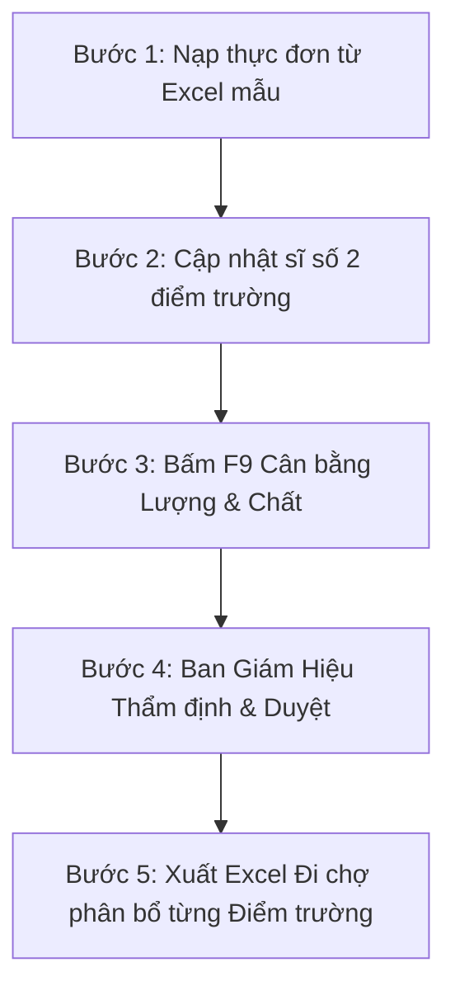

# QUY TRÌNH CHUẨN VẬN HÀNH BÁN TRÚ MẦM NON (SOP 5 BƯỚC)
**Đơn vị áp dụng:** TRƯỜNG MẪU GIÁO HÀM THẮNG (TP. PHAN THIẾT)  
**Tiêu chuẩn căn cứ:**  
- Quyết định số 2195/QĐ-BGDĐT của Bộ Giáo dục & Đào tạo.  
- Thông tư số 51/2020/TT-BGDĐT (Sửa đổi bổ sung Chương trình GDMN).  
- Quyết định số 1246/QĐ-BYT về Hướng dẫn kiểm thực 3 bước và lưu mẫu thức ăn.  

---

## 1. MỤC TIÊU QUY TRÌNH
Chuyển đổi toàn diện từ **Thực đơn mẫu / File Excel dự thảo** thành **Kế hoạch đi chợ hàng ngày theo từng điểm trường**:
1. Đảm bảo **"CHẤT"**: Calo (615 – 727 Kcal), Tỷ lệ P-L-C (13-20% : 25-35% : 52-60%), Đạm ĐV ≥ 50%, Béo TV 30-50%, muối Natri an toàn cho trẻ.
2. Đảm bảo **"LƯỢNG"**: Tính toán chính xác khối lượng mua thực tế (kg) trừ hao thải bỏ (waste factor) và chia chính xác theo sĩ số 2 điểm trường:
   - **Điểm 1 (Cơ sở chính):** 850 trẻ.
   - **Điểm 2 (Phân hiệu):** 360 trẻ.
   - **Tổng toàn trường:** 1.210 trẻ.
3. Đảm bảo **"TÀI CHÍNH"**: Khóa cứng quỹ ăn đúng **21.000 đ/trẻ/ngày** (sai số chi tiêu |chi - thu| ≤ 10đ/trẻ).

---

## 2. QUY TRÌNH 5 BƯỚC THỰC HIỆN CHI TIẾT

### BƯỚC 1: NẠP THỰC ĐƠN TỪ FILE EXCEL MẪU
1. Trên thanh công cụ, bấm nút **"📥 Nhập Excel"**.
2. Nếu chưa có file đúng chuẩn: Bấm **"Tải file mẫu Excel chuẩn"** để xem cấu trúc:
   - Cột A: Bữa ăn (`Chính trưa`, `Phụ trưa`, `Xế chiều`, `Phụ xế`).
   - Cột B: Tên món ăn (`Thịt heo kho cút`, `Canh bí đỏ tôm`...).
   - Cột C: Tên thực phẩm (`Thịt heo nạc`, `Trứng chim cút`, `Bí đỏ`...).
   - Cột D: Định lượng ước tính cho 1 trẻ (g/trẻ).
3. Kéo thả file Excel thực đơn của trường vào ô tải file.
4. Kiểm tra bảng xem trước: Hệ thống sẽ tự động khớp tên thực phẩm với **Danh mục 120+ thực phẩm chuẩn Viện Dinh Dưỡng**.
5. Bấm **"Nạp vào thực đơn ngày hiện tại"**.

---

### BƯỚC 2: CẬP NHẬT SĨ SỐ ĐIỂM DANH 2 ĐIỂM TRƯỜNG
1. Kiểm tra ô **Sĩ số** trên thanh công cụ:
   - Điểm 1 (Cơ sở chính): 850 trẻ.
   - Điểm 2 (Phân hiệu): 360 trẻ.
   - Nếu có ngày học sinh nghỉ đột xuất (thời tiết, dịch bệnh): Nhập lại sĩ số ăn thực tế hoặc bấm **"Đồng bộ điểm danh"**.
2. Hệ thống sẽ tự động tính toán tổng quỹ ăn trong ngày:  
   $$\text{Tổng quỹ ăn} = \text{Sĩ số thực tế} \times 21.000\text{ đ}$$

---

### BƯỚC 3: CÂN BẰNG "LƯỢNG" VÀ "CHẤT" (BẤM PHÍM F9)
1. Bấm nút màu cam **"⚡ Cân đối MILP (F9)"** hoặc bấm trực tiếp phím **F9** trên bàn phím máy tính.
2. Thuật toán **2-Phase Elastic Gradient Descent** sẽ tự động tính toán trong vòng dưới 100ms:
   - **Pha 1 (Cân bằng Chất):** Tự động điều chỉnh khối lượng đạm, dầu mỡ, rau củ để đưa Calo và tỷ lệ P-L-C vào chính giữa "Dải Vàng" của Bộ GD&ĐT.
   - **Pha 2 (Cân bằng Lượng & Ngân sách):** Khóa cứng chi phí trùng khớp 100% với định mức 21.000đ/trẻ.
3. Kiểm tra thanh trạng thái ma trận dinh dưỡng chân trang: Tất cả các đèn báo chuyển sang màu **Xanh lá (ĐẠT CHUẨN)**.

---

### BƯỚC 4: BAN GIÁM HIỆU THẨM ĐỊNH & PHÊ DUYỆT
1. Hiệu phó bán trú mở ngăn **"Thẩm định Dinh dưỡng"** (hoặc bấm nút Thẩm định) để rà soát:
   - Tỷ lệ đạm động vật ≥ 50%.
   - Hàm lượng Canxi, Sắt, Vitamin B1, C.
2. Bấm chọn trạng thái thực đơn: **"Hiệu trưởng duyệt (APPROVED)"**.
3. Khi đã chốt danh sách mua hàng: Bấm **"Khóa sổ (LOCKED)"** để bảo vệ dữ liệu, tránh bị chỉnh sửa ngoài ý muốn.

---

### BƯỚC 5: XUẤT FILE EXCEL PHIẾU ĐI CHỢ ĐIỂM TRƯỜNG
1. Bấm nút **"Xuất Excel Đi Chợ Điểm Trường"** (hoặc mở hộp thoại In A4).
2. Hệ thống tải về file Excel đa Sheet mang tên `Phieu_Di_Cho_Diem_Truong_[Ngay].xlsx`:
   - **Sheet 1 (`Tong_Hop_Ca_Truong`):** Tổng khối lượng cần đặt các nhà cung cấp (thịt, cá, rau, trứng, gia vị) cho cả 1.210 trẻ.
   - **Sheet 2 (`D1_Diem_1_Co_So_Chinh`):** Phiếu giao nhận riêng cho Bếp Cơ sở chính (khối lượng phục vụ 850 trẻ) có sẵn khung ký của người giao và người nhận bếp Đ1.
   - **Sheet 3 (`D2_Diem_2_Phan_Hieu`):** Phiếu giao nhận riêng cho Bếp Phân hiệu (khối lượng phục vụ 360 trẻ) có sẵn khung ký của người giao và người nhận bếp Đ2.
3. In phiếu hoặc gửi file Excel qua Zalo cho Bếp trưởng và Nhà cung cấp trước 16h00 hàng ngày để chuẩn bị thực phẩm tươi sáng hôm sau.

---

## 3. CÔNG THỨC TOÁN HỌC & KIỂM TRA ĐỊNH LƯỢNG
- **Khối lượng mua cả trường ($Kg$):**
  $$M_{\text{mua}} = \frac{\text{Định lượng (g/trẻ)} \times \text{Tổng sĩ số}}{1000 \times (1 - \frac{\text{Hệ số thải bỏ}}{100})}$$
- **Khối lượng phân bổ cho Điểm trường $i$ ($Kg$):**
  $$M_i = M_{\text{mua}} \times \frac{\text{Sĩ số điểm } i}{\text{Tổng sĩ số}}$$
- **Tổng kiểm tra bảo toàn:**
  $$\sum M_i = M_{\text{mua}} \quad (\text{Tuyệt đối không lệch hao hụt})$$
